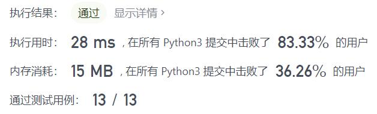
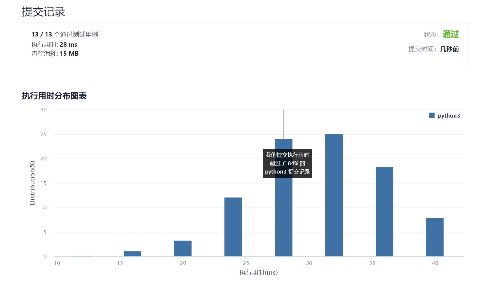

# 371-两整数之和

Author：_Mumu

创建日期：2021/9/26

通过日期：2021/9/26

*****

踩过的坑：

1. 自己硬生生写了一个转二进制然后按位计算的代码，十分冗长，不过虽然空间占用多，但运行时间倒不长
2. 一看题解傻眼了，好家伙原来是这么玩的，太优雅了
3. 核心是取补码后不必讨论正负都可以直接做相加的步骤
4. 相加的步骤如下：两数做位与运算并左移，得到进位值，然后两数取异或，并不断重复之前的步骤直到进位值为0
5. 而python中由于整数是无限长的，所以必须使用特殊方法来模拟有限长二进制补码再进行计算，最后再换算为python整数，方法是：假设限制位数为$n$，即整数范围在$[-2^n, 2^n-1]$，将数对$2^{n+1}$取模，不论正负都可变为该范围内的补码；而对计算完成后的数，令其与$2^n$取位与运算，若为$0$，说明结果在$[0, 2^n-1]$之间，说明计算结果是正数，可直接返回；若不为0，说明计算结果是负数，需要进行换算，而换算方法为将计算结果和$2^{n+1}-1$取异或（即在限制范围内取反码），得到的就是真正的计算结果在python中的反码，取反后则为正确的计算结果

已解决：98/2374

*****

难度：中等

问题描述：

给你两个整数 a 和 b ，不使用 运算符 + 和 - ，计算并返回两整数之和。

 

示例 1：

输入：a = 1, b = 2
输出：3
示例 2：

输入：a = 2, b = 3
输出：5

提示：

-1000 <= a, b <= 1000

来源：力扣（LeetCode）
链接：https://leetcode-cn.com/problems/sum-of-two-integers
