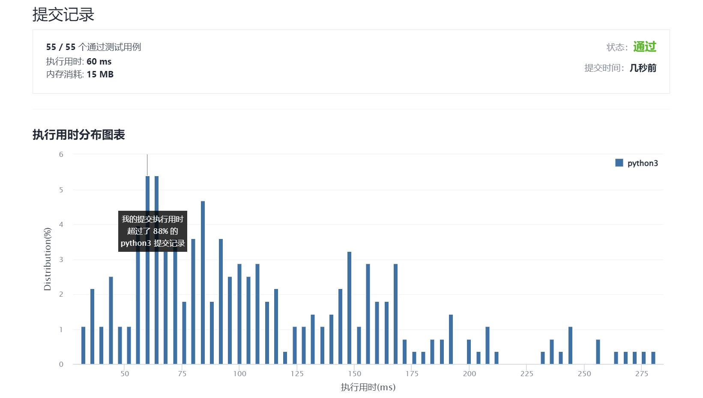

# 372-超级次方

Author：_Mumu

创建日期：2021/12/05

通过日期：2021/12/05

*****

踩过的坑：

1. 轻松愉快！
2. 十二月快乐！
3. 我知道要用快速幂的思想，不过第一反应变成先把指数转换为二进制，而这一步会使时间复杂度变为$O(n^2)$​，所以并不可取，而应该直接使用十进制进行快速幂计算，同时，可以用字典记录数字的$0$到$9$次幂的模，减少在计算大数每一位时的用时
4. 另外学到了用`pow(base, exp, mod)`可以直接计算快速幂取模
5. 不过感觉离谱的是，最快的算法居然是直接把列表变成整数再直接快速幂，毕竟python并不怕什么大数

已解决：167/2451

*****

难度：中等

问题描述：

你的任务是计算 ab 对 1337 取模，a 是一个正整数，b 是一个非常大的正整数且会以数组形式给出。

 

示例 1：

输入：a = 2, b = [3]
输出：8
示例 2：

输入：a = 2, b = [1,0]
输出：1024
示例 3：

输入：a = 1, b = [4,3,3,8,5,2]
输出：1
示例 4：

输入：a = 2147483647, b = [2,0,0]
输出：1198

提示：

1 <= a <= 231 - 1
1 <= b.length <= 2000
0 <= b[i] <= 9
b 不含前导 0

来源：力扣（LeetCode）
链接：https://leetcode-cn.com/problems/super-pow
