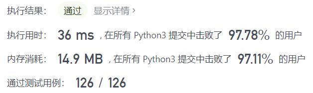
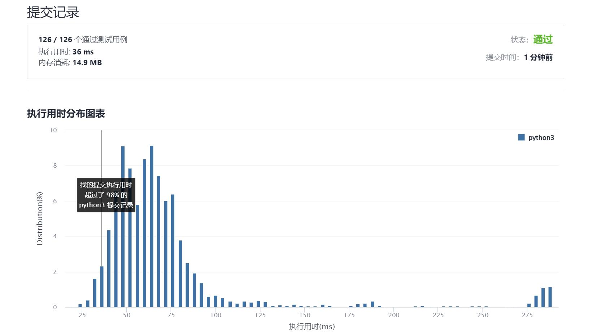

# 383-赎金信

Author：_Mumu

创建日期：2021/12/04

通过日期：2021/12/04

*****

踩过的坑：

1. 轻松愉快！
2. 十二月快乐！
3. `Counter`真尼玛好用！

已解决：166/2447

*****

难度：简单

问题描述：

为了不在赎金信中暴露字迹，从杂志上搜索各个需要的字母，组成单词来表达意思。

给你一个赎金信 (ransomNote) 字符串和一个杂志(magazine)字符串，判断 ransomNote 能不能由 magazines 里面的字符构成。

如果可以构成，返回 true ；否则返回 false 。

magazine 中的每个字符只能在 ransomNote 中使用一次。

 

示例 1：

输入：ransomNote = "a", magazine = "b"
输出：false
示例 2：

输入：ransomNote = "aa", magazine = "ab"
输出：false
示例 3：

输入：ransomNote = "aa", magazine = "aab"
输出：true

提示：

1 <= ransomNote.length, magazine.length <= 105
ransomNote 和 magazine 由小写英文字母组成

来源：力扣（LeetCode）
链接：https://leetcode-cn.com/problems/ransom-note
