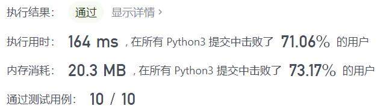
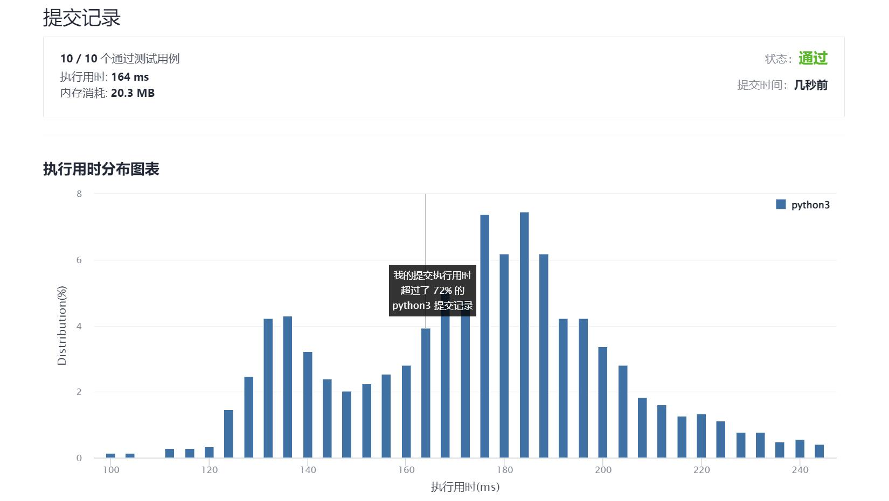

# 384-打乱数组

Author：_Mumu

创建日期：2021/11/22

通过日期：2021/11/22

*****

踩过的坑：

1. 还是蛮简单的
2. 不过看到直接用`sorted(list, key=lambda x: random())`打乱我是震惊的
3. 不过根据浮点数精度，是有一定概率发生打乱次序不均匀分布的情况的
4. 例如随机到了相同的数，则对应的数组中两个数的顺序就会固定不变，当然如果精度够高发生这种情况的概率就会很小
5. 还是题解的Fisher-Yates洗牌算法靠谱，直接通过交换形成已打乱的序列，避免复杂的删除操作，而且乱序后的排列一定是均匀出现的

已解决：154/2436

*****

难度：中等

问题描述：

给你一个整数数组 nums ，设计算法来打乱一个没有重复元素的数组。

实现 Solution class:

Solution(int[] nums) 使用整数数组 nums 初始化对象
int[] reset() 重设数组到它的初始状态并返回
int[] shuffle() 返回数组随机打乱后的结果

示例：

输入
["Solution", "shuffle", "reset", "shuffle"]
[[[1, 2, 3]], [], [], []]
输出
[null, [3, 1, 2], [1, 2, 3], [1, 3, 2]]

解释
Solution solution = new Solution([1, 2, 3]);
solution.shuffle();    // 打乱数组 [1,2,3] 并返回结果。任何 [1,2,3]的排列返回的概率应该相同。例如，返回 [3, 1, 2]
solution.reset();      // 重设数组到它的初始状态 [1, 2, 3] 。返回 [1, 2, 3]
solution.shuffle();    // 随机返回数组 [1, 2, 3] 打乱后的结果。例如，返回 [1, 3, 2]

提示：

1 <= nums.length <= 200
-106 <= nums[i] <= 106
nums 中的所有元素都是 唯一的
最多可以调用 5 * 104 次 reset 和 shuffle

来源：力扣（LeetCode）
链接：https://leetcode-cn.com/problems/shuffle-an-array
