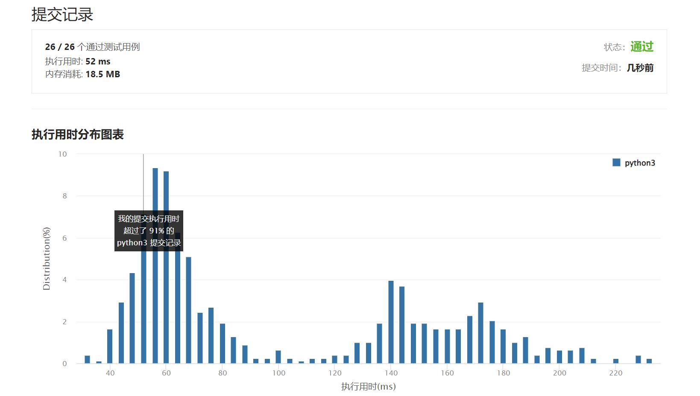

# 386-字典序排数

Author：_Mumu

创建日期：2022/04/18

通过日期：2022/04/18

*****

踩过的坑：

1. 轻松愉快
1. 第一眼看成字典树排序。。

已解决：313/2606

*****

难度：中等

问题描述：

给你一个整数 n ，按字典序返回范围 [1, n] 内所有整数。

你必须设计一个时间复杂度为 O(n) 且使用 O(1) 额外空间的算法。

 

示例 1：

输入：n = 13
输出：[1,10,11,12,13,2,3,4,5,6,7,8,9]
示例 2：

输入：n = 2
输出：[1,2]

提示：

1 <= n <= 5 * 104

来源：力扣（LeetCode）
链接：https://leetcode-cn.com/problems/lexicographical-numbers