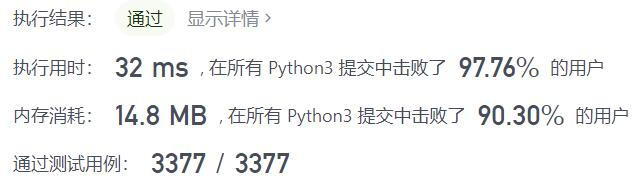
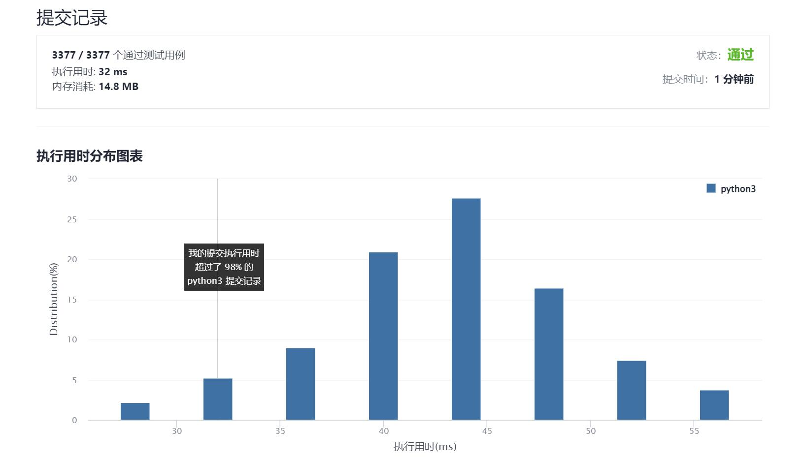

# 390-消除游戏

Author：_Mumu

创建日期：2022/01/02

通过日期：2022/01/02

*****

踩过的坑：

1. 确实做题还是要自己拿出笔写写算算才会明白
2. 发现留下的数字的递推规律：初值$a_1=1,a_2=2,a_3=2$，$n$为奇数时，$a_n=a_{n-1}$；$n$为偶数时，若$\frac{n}{2}$为奇数，$a_n=4a_{\lfloor\frac{n}{4}\rfloor}$，若$\frac{n}{2}$为偶数，$a_n=4a_{\lfloor\frac{n}{4}\rfloor}-2$​；那么简单的递归就能解决这个问题
3. 题解的方法是：每次操作剩下的数字都是一个等差数列，可以用项数$n_k$、首项$a_k^1$、公差$d_k$完美表示，初值$n_0=n,a_0^1=1,d_0=1$；每次操作，项数总满足$n_{k+1}=\lfloor\frac{n_k}{2}\rfloor$，公差总满足$d_{k+1}=2d_k$；当一次操作删除首项即$k\equiv0(mod\ 2)$【正向删除必删除首项】或者$k\equiv1(mod\ 2)$且$n_k\equiv1(mod\ 2)$【反向删除在项数为奇数时删除首项】时，首项更新$a_{k+1}^1=a_k^2=a_k^1+d_k$，否则首项不更新$a_{k+1}^1=a_k^1$​；当$n_k=1$时，数列中只剩一个元素，也就是所求答案，返回$a_k^1$
4. 突然发现递推的思路中，$n$为奇数时由于$\lfloor\frac{n}{2}\rfloor=\frac{n-1}{2}$且$\lfloor\frac{n}{4}\rfloor=\lfloor\frac{n-1}{4}\rfloor$，也可以直接判断$\lfloor\frac{n}{2}\rfloor$的奇偶性递推至$\lfloor\frac{n}{4}\rfloor$​项，加快运行速度；同时减少了递推步骤也减少了内存消耗​，实测确实快了不少，爽了

已解决：195/2482

*****

难度：中等

问题描述：

列表 arr 由在范围 [1, n] 中的所有整数组成，并按严格递增排序。请你对 arr 应用下述算法：

从左到右，删除第一个数字，然后每隔一个数字删除一个，直到到达列表末尾。
重复上面的步骤，但这次是从右到左。也就是，删除最右侧的数字，然后剩下的数字每隔一个删除一个。
不断重复这两步，从左到右和从右到左交替进行，直到只剩下一个数字。
给你整数 n ，返回 arr 最后剩下的数字。

 

示例 1：

输入：n = 9
输出：6
解释：
arr = [1, 2, 3, 4, 5, 6, 7, 8, 9]
arr = [2, 4, 6, 8]
arr = [2, 6]
arr = [6]
示例 2：

输入：n = 1
输出：1

提示：

1 <= n <= 109

来源：力扣（LeetCode）
链接：https://leetcode-cn.com/problems/elimination-game
