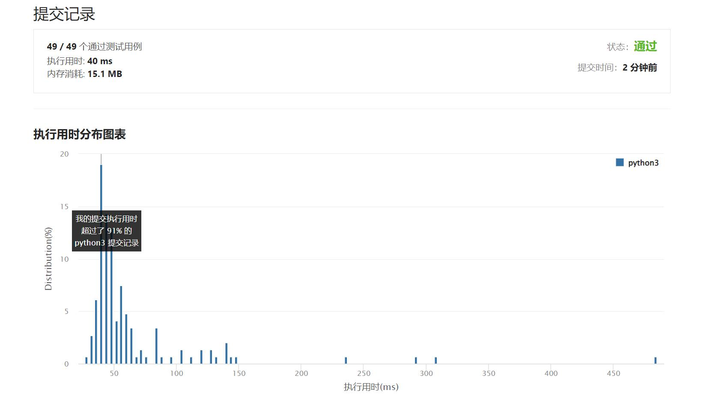

# 393-UTF-8编码验证

Author：_Mumu

创建日期：2022/03/13

通过日期：2022/03/13

*****

踩过的坑：

1. 轻松愉快
1. 判断数据范围就完事了

已解决：277/2554

*****

难度：中等

问题描述：

给定一个表示数据的整数数组 data ，返回它是否为有效的 UTF-8 编码。

UTF-8 中的一个字符可能的长度为 1 到 4 字节，遵循以下的规则：

对于 1 字节 的字符，字节的第一位设为 0 ，后面 7 位为这个符号的 unicode 码。
对于 n 字节 的字符 (n > 1)，第一个字节的前 n 位都设为1，第 n+1 位设为 0 ，后面字节的前两位一律设为 10 。剩下的没有提及的二进制位，全部为这个符号的 unicode 码。
这是 UTF-8 编码的工作方式：

   Char. number range  |        UTF-8 octet sequence
      (hexadecimal)    |              (binary)
   --------------------+---------------------------------------------
   0000 0000-0000 007F | 0xxxxxxx
   0000 0080-0000 07FF | 110xxxxx 10xxxxxx
   0000 0800-0000 FFFF | 1110xxxx 10xxxxxx 10xxxxxx
   0001 0000-0010 FFFF | 11110xxx 10xxxxxx 10xxxxxx 10xxxxxx
注意：输入是整数数组。只有每个整数的 最低 8 个有效位 用来存储数据。这意味着每个整数只表示 1 字节的数据。

 

示例 1：

输入：data = [197,130,1]
输出：true
解释：数据表示字节序列:11000101 10000010 00000001。
这是有效的 utf-8 编码，为一个 2 字节字符，跟着一个 1 字节字符。
示例 2：

输入：data = [235,140,4]
输出：false
解释：数据表示 8 位的序列: 11101011 10001100 00000100.
前 3 位都是 1 ，第 4 位为 0 表示它是一个 3 字节字符。
下一个字节是开头为 10 的延续字节，这是正确的。
但第二个延续字节不以 10 开头，所以是不符合规则的。

提示:

1 <= data.length <= 2 * 104
0 <= data[i] <= 255

来源：力扣（LeetCode）
链接：https://leetcode-cn.com/problems/utf-8-validation