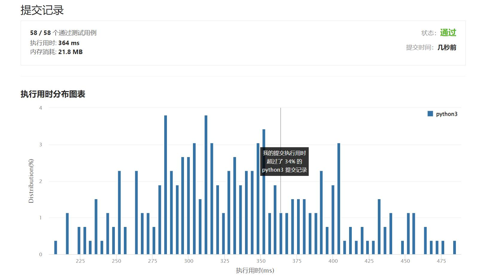

# 396-旋转函数

Author：_Mumu

创建日期：2022/04/22

通过日期：2022/04/22

*****

踩过的坑：

1. 轻松愉快（指直接看题解思路

已解决：317/2607

*****

难度：中等

问题描述：

给定一个长度为 n 的整数数组 nums 。

假设 arrk 是数组 nums 顺时针旋转 k 个位置后的数组，我们定义 nums 的 旋转函数  F 为：

F(k) = 0 * arrk[0] + 1 * arrk[1] + ... + (n - 1) * arrk[n - 1]
返回 F(0), F(1), ..., F(n-1)中的最大值 。

生成的测试用例让答案符合 32 位 整数。

 

示例 1:

输入: nums = [4,3,2,6]
输出: 26
解释:
F(0) = (0 * 4) + (1 * 3) + (2 * 2) + (3 * 6) = 0 + 3 + 4 + 18 = 25
F(1) = (0 * 6) + (1 * 4) + (2 * 3) + (3 * 2) = 0 + 4 + 6 + 6 = 16
F(2) = (0 * 2) + (1 * 6) + (2 * 4) + (3 * 3) = 0 + 6 + 8 + 9 = 23
F(3) = (0 * 3) + (1 * 2) + (2 * 6) + (3 * 4) = 0 + 2 + 12 + 12 = 26
所以 F(0), F(1), F(2), F(3) 中的最大值是 F(3) = 26 。
示例 2:

输入: nums = [100]
输出: 0

提示:

n == nums.length
1 <= n <= 105
-100 <= nums[i] <= 100

来源：力扣（LeetCode）
链接：https://leetcode-cn.com/problems/rotate-function