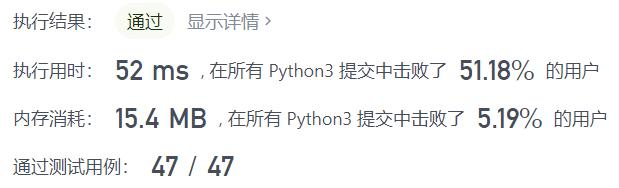
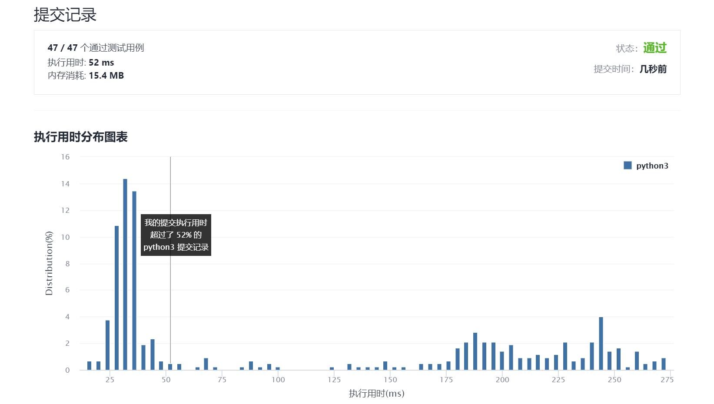

# 397-整数替换

Author：_Mumu

创建日期：2021/11/19

通过日期：2021/11/19

*****

踩过的坑：

1. 还以为是简单的广度优先搜索，结果又是数学题

已解决：151/2432

*****

难度：中等

问题描述：

给定一个正整数 n ，你可以做如下操作：

如果 n 是偶数，则用 n / 2替换 n 。
如果 n 是奇数，则可以用 n + 1或n - 1替换 n 。
n 变为 1 所需的最小替换次数是多少？

 

示例 1：

输入：n = 8
输出：3
解释：8 -> 4 -> 2 -> 1
示例 2：

输入：n = 7
输出：4
解释：7 -> 8 -> 4 -> 2 -> 1
或 7 -> 6 -> 3 -> 2 -> 1
示例 3：

输入：n = 4
输出：2

提示：

1 <= n <= 231 - 1

来源：力扣（LeetCode）
链接：https://leetcode-cn.com/problems/integer-replacement
