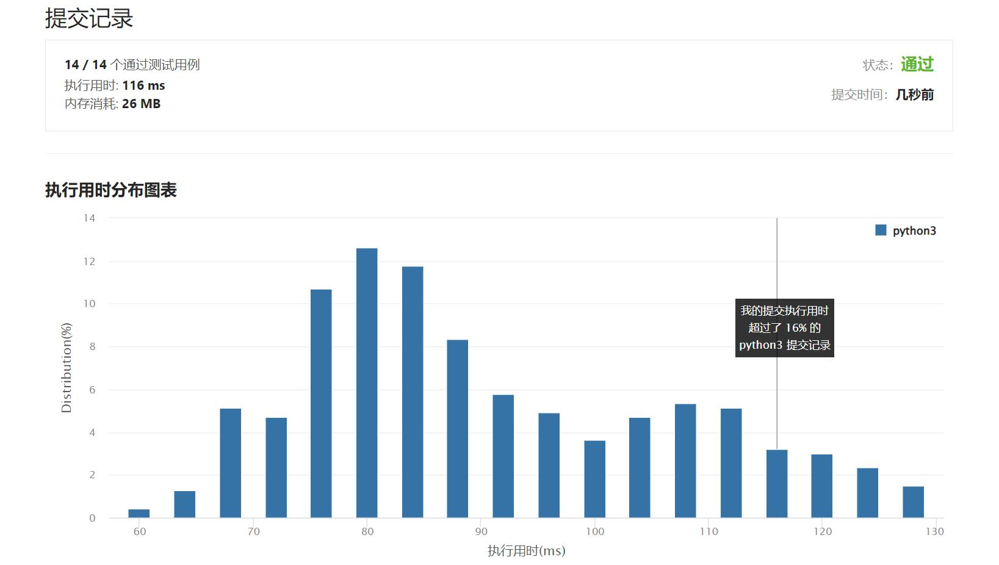

# 398-随机数索引

Author：_Mumu

创建日期：2022/04/25

通过日期：2022/04/25

*****

踩过的坑：

1. 轻松愉快

已解决：320/2619

*****

难度：中等

问题描述：

给定一个可能含有重复元素的整数数组，要求随机输出给定的数字的索引。 您可以假设给定的数字一定存在于数组中。

注意：
数组大小可能非常大。 使用太多额外空间的解决方案将不会通过测试。

示例:

int[] nums = new int[] {1,2,3,3,3};
Solution solution = new Solution(nums);

// pick(3) 应该返回索引 2,3 或者 4。每个索引的返回概率应该相等。
solution.pick(3);

// pick(1) 应该返回 0。因为只有nums[0]等于1。
solution.pick(1);

来源：力扣（LeetCode）
链接：https://leetcode-cn.com/problems/random-pick-index