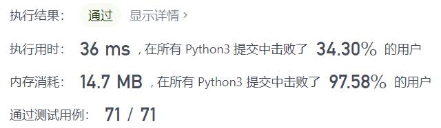
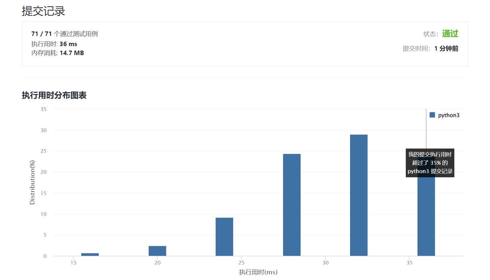

# 400-第N位数字

Author：_Mumu

创建日期：2021/11/30

通过日期：2021/11/30

*****

踩过的坑：

1. 轻松呀
2. 最重要的就是搞清楚是哪个数字的第几位

已解决：162/2447

*****

难度：中等

问题描述：

给你一个整数 n ，请你在无限的整数序列 [1, 2, 3, 4, 5, 6, 7, 8, 9, 10, 11, ...] 中找出并返回第 n 位上的数字。

 

示例 1：

输入：n = 3
输出：3
示例 2：

输入：n = 11
输出：0
解释：第 11 位数字在序列 1, 2, 3, 4, 5, 6, 7, 8, 9, 10, 11, ... 里是 0 ，它是 10 的一部分。

提示：

1 <= n <= 231 - 1
第 n 位上的数字是按计数单位（digit）从前往后数的第 n 个数，参见 示例 2 。

来源：力扣（LeetCode）
链接：https://leetcode-cn.com/problems/nth-digit
