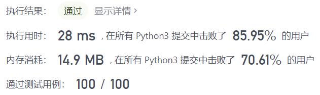
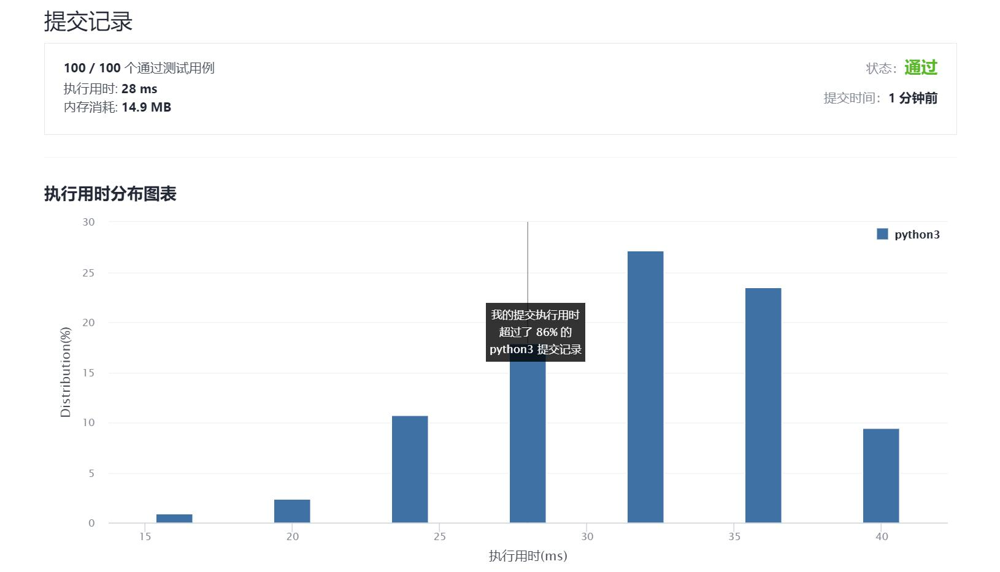

# 405-数字转换为十六进制数

Author：_Mumu

创建日期：2021/10/2

通过日期：2021/10/2

*****

踩过的坑：

1. 还行
2. 非负数没啥可说的，负数嘛，不想加上$2^{32}$后再转换，因为觉得数字太大拖慢速度
3. 于是直接取相反数硬转，一开始想到的是先转换然后取反码再加一，但这样写出来实在繁琐
4. 看了别人的写法才发现，可以直接加一后取相反数再转，然后取反码，这样就简洁很多，舒服
5. 简单题也不简单呀

已解决：104/2376

*****

难度：简单

问题描述：

给定一个整数，编写一个算法将这个数转换为十六进制数。对于负整数，我们通常使用 补码运算 方法。

注意:

十六进制中所有字母(a-f)都必须是小写。
十六进制字符串中不能包含多余的前导零。如果要转化的数为0，那么以单个字符'0'来表示；对于其他情况，十六进制字符串中的第一个字符将不会是0字符。 
给定的数确保在32位有符号整数范围内。
不能使用任何由库提供的将数字直接转换或格式化为十六进制的方法。
示例 1：

输入:
26

输出:
"1a"
示例 2：

输入:
-1

输出:
"ffffffff"

来源：力扣（LeetCode）
链接：https://leetcode-cn.com/problems/convert-a-number-to-hexadecimal
