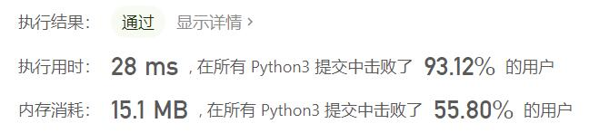
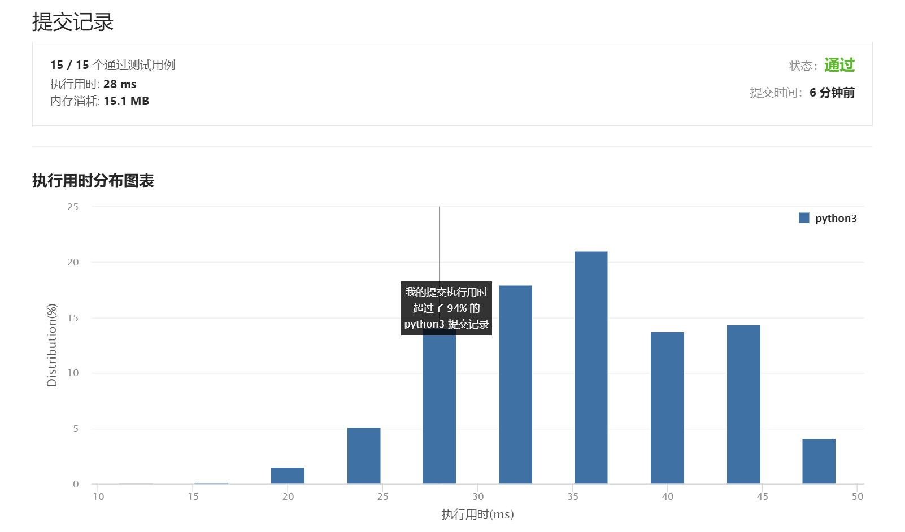

# 413-等差数列划分

Author：_Mumu

创建日期：2021/8/10

通过日期：2021/8/10

*****

踩过的坑：

1. 第一反应是找到数组中的极大等差数列（不可再在数组中向左或向右扩展得到更长的等差数列）并统计他们的长度，假设某一段等差数列长度为$n$，则它包含$\frac{(n-1)(n-2)}{2}$​个不同的子等差数列，再将所有等差数列的子等差数列的个数相加即得到答案
2. 实际操作上，第一反应想到了计算`nums`的前后项差存入新的数组`diffs`，通过找到`diffs`中各个所有元素都相同的极大子数组并计算他们的长度，假设某一段极大子数组对应的原数组中极大等差数列的长度为$n$，则该子数组长度为$n-1$，将长度$n$存入新的数组`longest_slices`，遍历`longest_slices`计算得到答案
3. 然后尝试优化了一下算法，其实之前需要创建的两个新的数组都不需要创建，直接在遍历原数组的过程中计算判断即可，占用空间大大缩小
4. 另外需要注意的是，如果使用当前前后项差是否等于之前前后项差的条件来判断等差数列的边界，那么遍历结束后需要再计算数组最后一个极大等差数列的子数列个数，因为遍历结束时它并不会被计算到

已解决：63/2309

*****

难度：中等

问题描述：

如果一个数列 至少有三个元素 ，并且任意两个相邻元素之差相同，则称该数列为等差数列。

例如，[1,3,5,7,9]、[7,7,7,7] 和 [3,-1,-5,-9] 都是等差数列。
给你一个整数数组 nums ，返回数组 nums 中所有为等差数组的 子数组 个数。

子数组 是数组中的一个连续序列。

 

示例 1：

输入：nums = [1,2,3,4]
输出：3
解释：nums 中有三个子等差数组：[1, 2, 3]、[2, 3, 4] 和 [1,2,3,4] 自身。
示例 2：

输入：nums = [1]
输出：0

提示：

1 <= nums.length <= 5000
-1000 <= nums[i] <= 1000

来源：力扣（LeetCode）
链接：https://leetcode-cn.com/problems/arithmetic-slices
