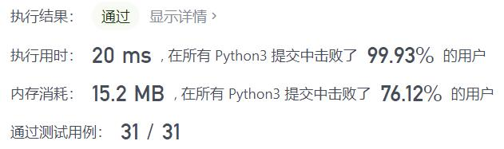
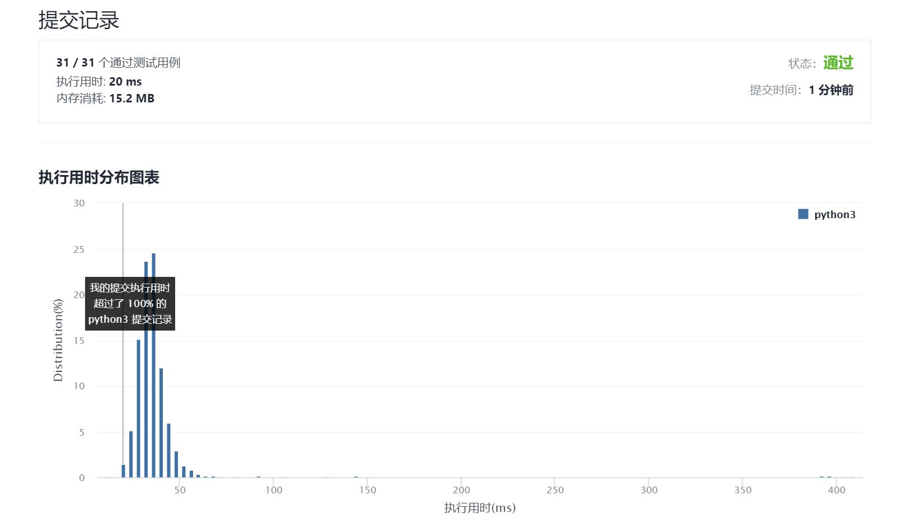

# 414-第三大的数

Author：_Mumu

创建日期：2021/10/6

通过日期：2021/10/6

*****

踩过的坑：

1. 第一反应小根堆，结果还是想复杂了
2. 一看题解原来只需要维护三个变量分类讨论就行了
3. 经典大炮打蚊子

已解决：108/2385

*****

难度：简单

问题描述：

给你一个非空数组，返回此数组中 第三大的数 。如果不存在，则返回数组中最大的数。

 

示例 1：

输入：[3, 2, 1]
输出：1
解释：第三大的数是 1 。
示例 2：

输入：[1, 2]
输出：2
解释：第三大的数不存在, 所以返回最大的数 2 。
示例 3：

输入：[2, 2, 3, 1]
输出：1
解释：注意，要求返回第三大的数，是指在所有不同数字中排第三大的数。
此例中存在两个值为 2 的数，它们都排第二。在所有不同数字中排第三大的数为 1 。

提示：

1 <= nums.length <= 104
-231 <= nums[i] <= 231 - 1

进阶：你能设计一个时间复杂度 O(n) 的解决方案吗？

来源：力扣（LeetCode）
链接：https://leetcode-cn.com/problems/third-maximum-number
