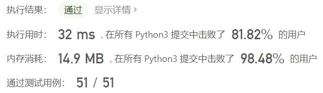
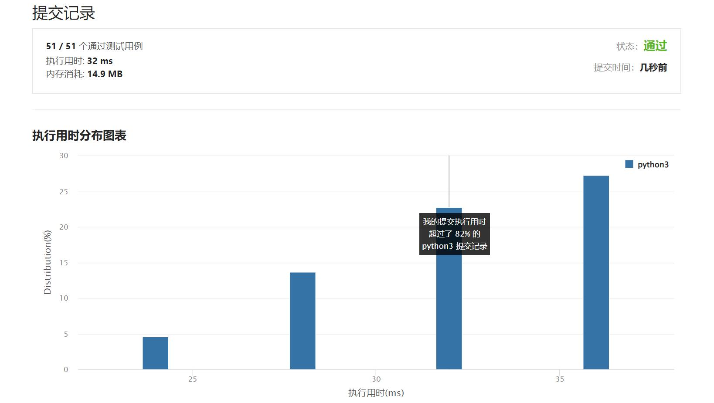

# 420-强密码检验器

Author：_Mumu

创建日期：2022/04/02

通过日期：2022/04/02

*****

踩过的坑：

1. 我讨厌强行写规则
1. cv大师lhy

已解决：297/2573

*****

难度：困难

问题描述：

如果一个密码满足下述所有条件，则认为这个密码是强密码：
由至少 6 个，至多 20 个字符组成。
至少包含 一个小写 字母，一个大写 字母，和 一个数字 。
同一字符 不能 连续出现三次 (比如 "...aaa..." 是不允许的, 但是 "...aa...a..." 如果满足其他条件也可以算是强密码)。
给你一个字符串 password ，返回 将 password 修改到满足强密码条件需要的最少修改步数。如果 password 已经是强密码，则返回 0 。

在一步修改操作中，你可以：

插入一个字符到 password ，
从 password 中删除一个字符，或
用另一个字符来替换 password 中的某个字符。

示例 1：

输入：password = "a"
输出：5
示例 2：

输入：password = "aA1"
输出：3
示例 3：

输入：password = "1337C0d3"
输出：0

提示：

1 <= password.length <= 50
password 由字母、数字、点 '.' 或者感叹号 '!'

来源：力扣（LeetCode）
链接：https://leetcode-cn.com/problems/strong-password-checker