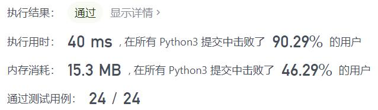
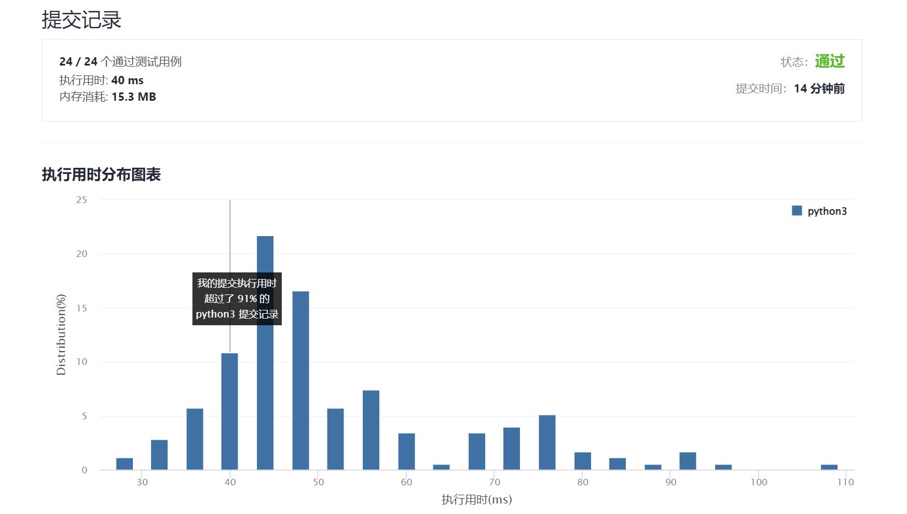

# 423-从英文中重建数字

Author：_Mumu

创建日期：2021/11/24

通过日期：2021/11/24

*****

踩过的坑：

1. 有点太简单

已解决：156/2437

*****

难度：中等

问题描述：

给你一个字符串 s ，其中包含字母顺序打乱的用英文单词表示的若干数字（0-9）。按 升序 返回原始的数字。

 

示例 1：

输入：s = "owoztneoer"
输出："012"
示例 2：

输入：s = "fviefuro"
输出："45"

提示：

1 <= s.length <= 105
s[i] 为 ["e","g","f","i","h","o","n","s","r","u","t","w","v","x","z"] 这些字符之一
s 保证是一个符合题目要求的字符串

来源：力扣（LeetCode）
链接：https://leetcode-cn.com/problems/reconstruct-original-digits-from-english
