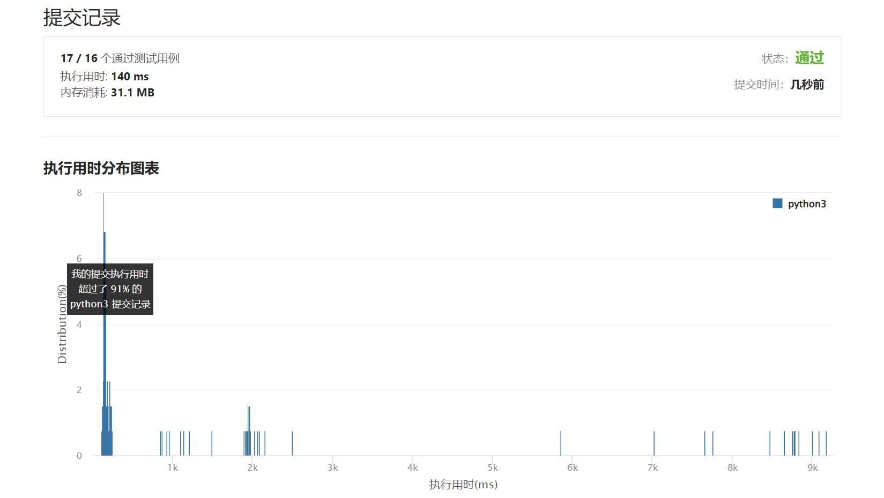

# 432-全O(1)的数据结构

Author：_Mumu

创建日期：2022/03/16

通过日期：2022/03/16

*****

踩过的坑：

1. 链表哨兵这个用法真是学到了

已解决：280/2558

*****

难度：困难

问题描述：

请你设计一个用于存储字符串计数的数据结构，并能够返回计数最小和最大的字符串。

实现 AllOne 类：

AllOne() 初始化数据结构的对象。
inc(String key) 字符串 key 的计数增加 1 。如果数据结构中尚不存在 key ，那么插入计数为 1 的 key 。
dec(String key) 字符串 key 的计数减少 1 。如果 key 的计数在减少后为 0 ，那么需要将这个 key 从数据结构中删除。测试用例保证：在减少计数前，key 存在于数据结构中。
getMaxKey() 返回任意一个计数最大的字符串。如果没有元素存在，返回一个空字符串 "" 。
getMinKey() 返回任意一个计数最小的字符串。如果没有元素存在，返回一个空字符串 "" 。

示例：

输入
["AllOne", "inc", "inc", "getMaxKey", "getMinKey", "inc", "getMaxKey", "getMinKey"]
[[], ["hello"], ["hello"], [], [], ["leet"], [], []]
输出
[null, null, null, "hello", "hello", null, "hello", "leet"]

解释
AllOne allOne = new AllOne();
allOne.inc("hello");
allOne.inc("hello");
allOne.getMaxKey(); // 返回 "hello"
allOne.getMinKey(); // 返回 "hello"
allOne.inc("leet");
allOne.getMaxKey(); // 返回 "hello"
allOne.getMinKey(); // 返回 "leet"

提示：

1 <= key.length <= 10
key 由小写英文字母组成
测试用例保证：在每次调用 dec 时，数据结构中总存在 key
最多调用 inc、dec、getMaxKey 和 getMinKey 方法 5 * 104 次

来源：力扣（LeetCode）
链接：https://leetcode-cn.com/problems/all-oone-data-structure