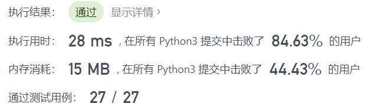
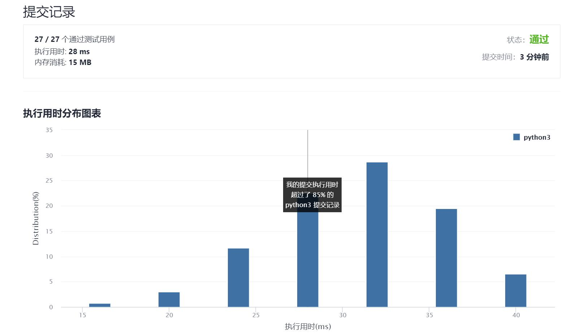

# 434-字符串中的单词数

Author：_Mumu

创建日期：2021/10/7

通过日期：2021/10/7

*****

踩过的坑：

1. 放水题

已解决：109/2385

*****

难度：简单

问题描述：

统计字符串中的单词个数，这里的单词指的是连续的不是空格的字符。

请注意，你可以假定字符串里不包括任何不可打印的字符。

示例:

输入: "Hello, my name is John"
输出: 5
解释: 这里的单词是指连续的不是空格的字符，所以 "Hello," 算作 1 个单词。

来源：力扣（LeetCode）
链接：https://leetcode-cn.com/problems/number-of-segments-in-a-string
