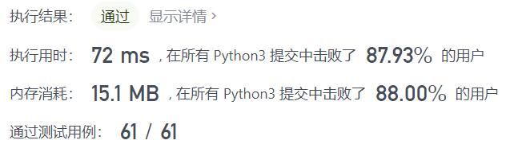
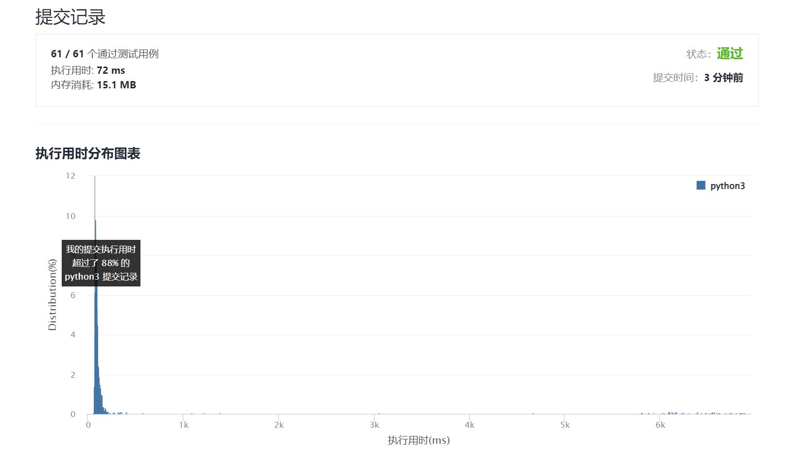

# 438-找到字符串中所有字母异位词

Author：_Mumu

创建日期：2021/11/28

通过日期：2021/11/28

*****

踩过的坑：

1. 十分轻松了
2. 一开始使用`defaultdict(int)`方便统计，然后才发现用长度为26的数字列表更方便，甚至可以直接算两者的差值，滑动窗口的同时动态地维护列表中不等于0的元素的数量，数量为0时添加答案

已解决：160/2447

*****

难度：中等

问题描述：

给定两个字符串 s 和 p，找到 s 中所有 p 的 异位词 的子串，返回这些子串的起始索引。不考虑答案输出的顺序。

异位词 指由相同字母重排列形成的字符串（包括相同的字符串）。

 

示例 1:

输入: s = "cbaebabacd", p = "abc"
输出: [0,6]
解释:
起始索引等于 0 的子串是 "cba", 它是 "abc" 的异位词。
起始索引等于 6 的子串是 "bac", 它是 "abc" 的异位词。
 示例 2:

输入: s = "abab", p = "ab"
输出: [0,1,2]
解释:
起始索引等于 0 的子串是 "ab", 它是 "ab" 的异位词。
起始索引等于 1 的子串是 "ba", 它是 "ab" 的异位词。
起始索引等于 2 的子串是 "ab", 它是 "ab" 的异位词。

提示:

1 <= s.length, p.length <= 3 * 104
s 和 p 仅包含小写字母

来源：力扣（LeetCode）
链接：https://leetcode-cn.com/problems/find-all-anagrams-in-a-string
