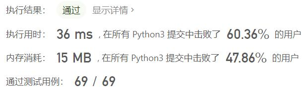
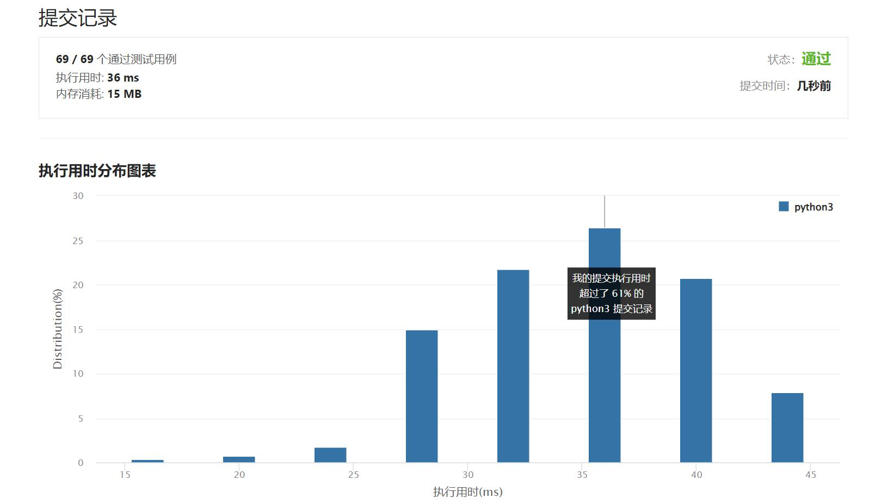

# 440-字典序的第K小数字

Author：_Mumu

创建日期：2022/03/23

通过日期：2022/03/23

*****

踩过的坑：

1. 轻松愉快（指直接cv

已解决：287/2568

*****

难度：困难

问题描述：

给定整数 n 和 k，返回  [1, n] 中字典序第 k 小的数字。

 

示例 1:

输入: n = 13, k = 2
输出: 10
解释: 字典序的排列是 [1, 10, 11, 12, 13, 2, 3, 4, 5, 6, 7, 8, 9]，所以第二小的数字是 10。
示例 2:

输入: n = 1, k = 1
输出: 1

提示:

1 <= k <= n <= 109

来源：力扣（LeetCode）
链接：https://leetcode-cn.com/problems/k-th-smallest-in-lexicographical-order