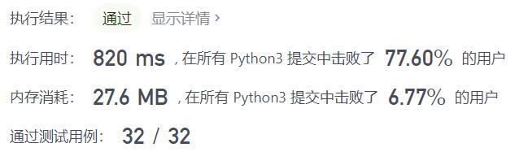
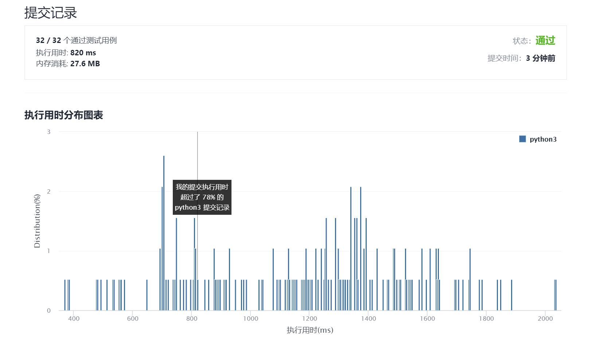

# 447-回旋镖的数量

Author：_Mumu

创建日期：2021/9/13

通过日期：2021/9/13

*****

踩过的坑：

1. 就纯暴力枚举呗，和题解相比省去一半计算量，速度更快但是空间占用更大
2. 时间最快的那个算法，好像是计算总的组合数，然后返回组合数×2，但是不知道为什么能够快那么多

已解决：88/2353

*****

难度：中等

问题描述：

给定平面上 n 对 互不相同 的点 points ，其中 points[i] = [xi, yi] 。回旋镖 是由点 (i, j, k) 表示的元组 ，其中 i 和 j 之间的距离和 i 和 k 之间的距离相等（需要考虑元组的顺序）。

返回平面上所有回旋镖的数量。

示例 1：

输入：points = [[0,0],[1,0],[2,0]]
输出：2
解释：两个回旋镖为 [[1,0],[0,0],[2,0]] 和 [[1,0],[2,0],[0,0]]
示例 2：

输入：points = [[1,1],[2,2],[3,3]]
输出：2
示例 3：

输入：points = [[1,1]]
输出：0

提示：

n == points.length
1 <= n <= 500
points[i].length == 2
-104 <= xi, yi <= 104
所有点都 互不相同

来源：力扣（LeetCode）
链接：https://leetcode-cn.com/problems/number-of-boomerangs
