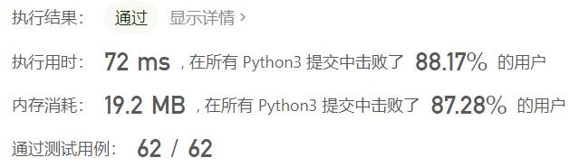
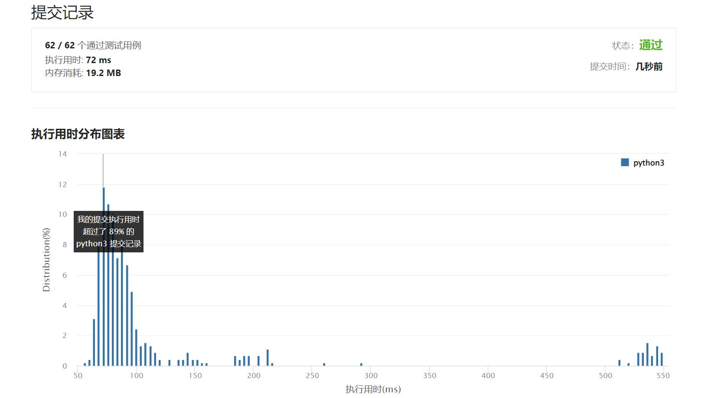

# 449-序列化和反序列化二叉搜索树

Author：_Mumu

创建日期：2022/05/11

通过日期：2022/05/11

*****

踩过的坑：

1. 轻松愉快
1. 用bfs写了个所有二叉树通用的算法
1. 看了大佬用dfs写的，简洁漂亮
1. 注意空树的处理

已解决：336/2634

*****

难度：中等

问题描述：

序列化是将数据结构或对象转换为一系列位的过程，以便它可以存储在文件或内存缓冲区中，或通过网络连接链路传输，以便稍后在同一个或另一个计算机环境中重建。

设计一个算法来序列化和反序列化 二叉搜索树 。 对序列化/反序列化算法的工作方式没有限制。 您只需确保二叉搜索树可以序列化为字符串，并且可以将该字符串反序列化为最初的二叉搜索树。

编码的字符串应尽可能紧凑。

 

示例 1：

输入：root = [2,1,3]
输出：[2,1,3]
示例 2：

输入：root = []
输出：[]

提示：

树中节点数范围是 [0, 104]
0 <= Node.val <= 104
题目数据 保证 输入的树是一棵二叉搜索树。

来源：力扣（LeetCode）
链接：https://leetcode.cn/problems/serialize-and-deserialize-bst