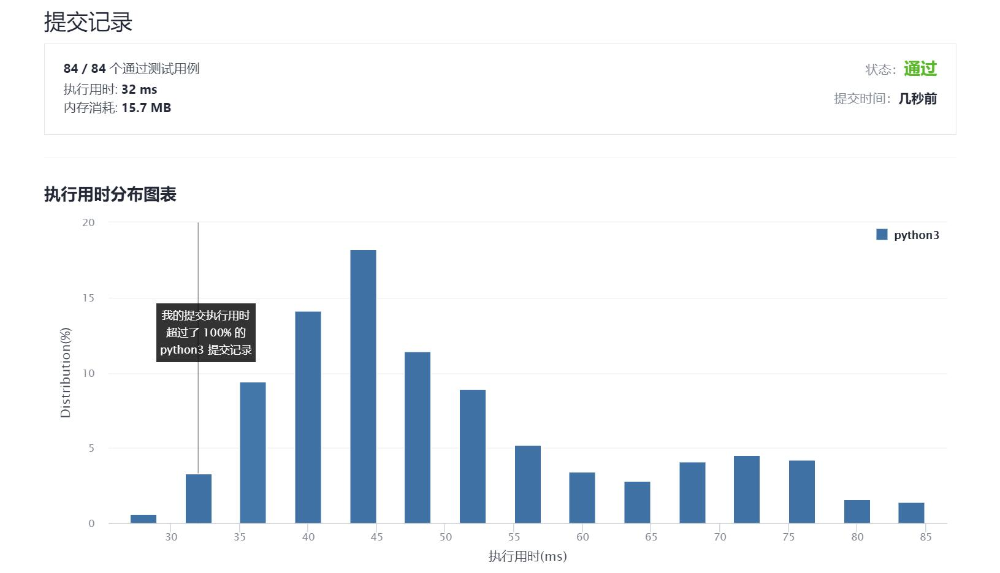

# 453-最小操作次数使数组元素相等

Author：_Mumu

创建日期：2021/10/20

通过日期：2021/10/20

*****

踩过的坑：

1. 好家伙，确实没想到$n-1$个加一就是一个减一

已解决：123/2400

*****

难度：简单

问题描述：

给你一个长度为 n 的整数数组，每次操作将会使 n - 1 个元素增加 1 。返回让数组所有元素相等的最小操作次数。

 

示例 1：

输入：nums = [1,2,3]
输出：3
解释：
只需要3次操作（注意每次操作会增加两个元素的值）：
[1,2,3]  =>  [2,3,3]  =>  [3,4,3]  =>  [4,4,4]
示例 2：

输入：nums = [1,1,1]
输出：0

提示：

n == nums.length
1 <= nums.length <= 105
-109 <= nums[i] <= 109
答案保证符合 32-bit 整数

来源：力扣（LeetCode）
链接：https://leetcode-cn.com/problems/minimum-moves-to-equal-array-elements
