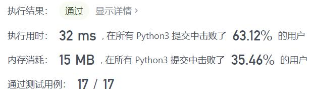
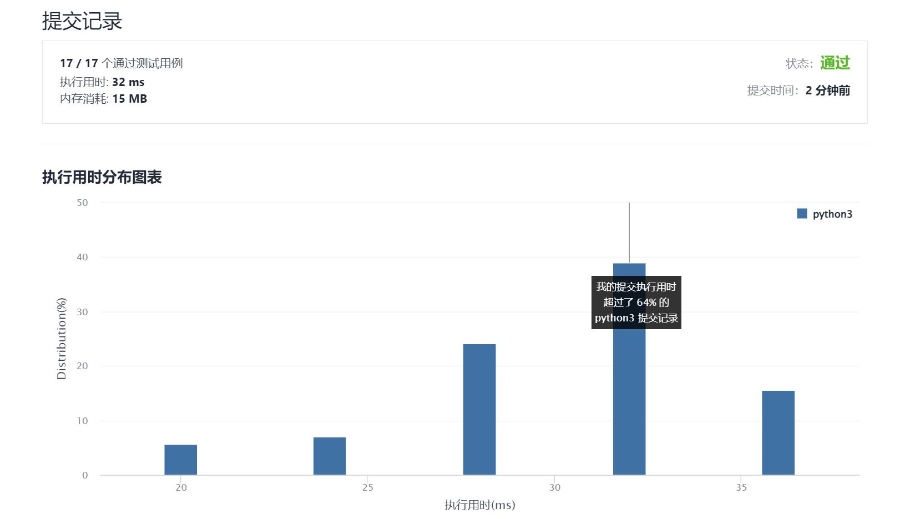

# 458-可怜的小猪

Author：_Mumu

创建日期：2021/11/25

通过日期：2021/11/25

*****

踩过的坑：

1. 残忍如斯
2. 转化为$m$只猪$n$轮最多能检验多少桶更好理解与操作，没想到是$(n+1)^m$这个结果
3. 题解使用的是动态规划，实话说规划的逻辑有点没讲清楚，为什么要取组合数呢？
4. 我觉得难度在于理解轮次对于检测的意义
5. 考虑一只猪喝过$n$​轮水的状态，喝过第$i$轮后死亡则说明这一轮的水有问题，而如果测试结束都没死亡，说明没喝过的水是有问题的
6. 一只猪$n$轮能检测$n+1$桶水，考虑每一只猪是一个维度，那么一个维度上最大能包含$n+1$​​个信息，根据坐标的一一对应，那么两只猪两个维度就能检测一个大小为$(n+1)^2$​的正方形阵列的水桶，三只猪就可以检测一个$(n+1)^3$的立方体阵列，同理可递推
7. 还可以考虑用进制来理解：
8. 只进行一轮检测的话其实很简单，水桶编号，每个二进制位表示一只猪，$1$表示喝，$0$表示不喝，那么根据猪的死亡情况，哪几只猪死亡，有毒水桶编号对应的二进制位就是$1$，哪几只猪没死，有毒水桶编号对应二进制位就是$0$，这样就可以确定有毒水桶的编号
9. 同样的，$n$轮检测则考虑编号的$n+1$进制，每一位表示一只猪，$i\in \{1,...,n\}$表示这只猪在第$i$轮喝这桶水，$0$表示这只猪不喝这桶水，$\forall j\in\{1,...,n\}$若某只猪在第$j$轮后死亡，那么有毒桶的编号对应位就是$j$，若某只猪最后或者，那么毒桶编号对应位就是$0$，由此可以确定有毒水桶的编号
10. 而$m$位$n+1$进制最多能表示的数字有$(n+1)^m$个，所以这就是$m$只猪$n$轮最多能检验的桶数
11. 题目给了桶数与轮数，取对数再向上取整即可

已解决：157/2438

*****

难度：困难

问题描述：

有 buckets 桶液体，其中 正好 有一桶含有毒药，其余装的都是水。它们从外观看起来都一样。为了弄清楚哪只水桶含有毒药，你可以喂一些猪喝，通过观察猪是否会死进行判断。不幸的是，你只有 minutesToTest 分钟时间来确定哪桶液体是有毒的。

喂猪的规则如下：

选择若干活猪进行喂养
可以允许小猪同时饮用任意数量的桶中的水，并且该过程不需要时间。
小猪喝完水后，必须有 minutesToDie 分钟的冷却时间。在这段时间里，你只能观察，而不允许继续喂猪。
过了 minutesToDie 分钟后，所有喝到毒药的猪都会死去，其他所有猪都会活下来。
重复这一过程，直到时间用完。
给你桶的数目 buckets ，minutesToDie 和 minutesToTest ，返回在规定时间内判断哪个桶有毒所需的 最小 猪数。

 

示例 1：

输入：buckets = 1000, minutesToDie = 15, minutesToTest = 60
输出：5
示例 2：

输入：buckets = 4, minutesToDie = 15, minutesToTest = 15
输出：2
示例 3：

输入：buckets = 4, minutesToDie = 15, minutesToTest = 30
输出：2

提示：

1 <= buckets <= 1000
1 <= minutesToDie <= minutesToTest <= 100

来源：力扣（LeetCode）
链接：https://leetcode-cn.com/problems/poor-pigs
