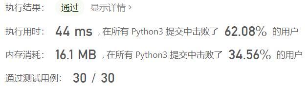
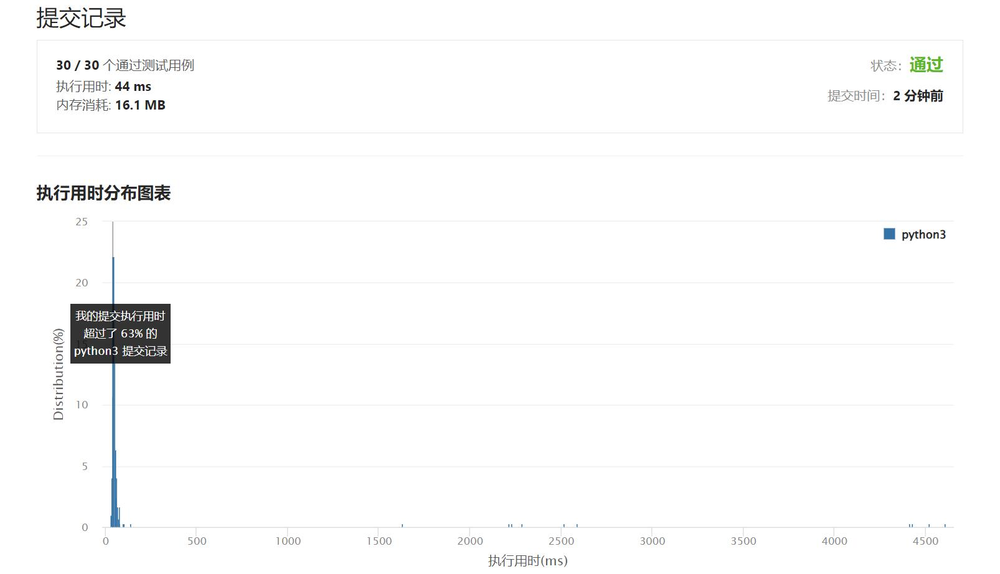

# 462-最少移动次数使数组元素相等II

Author：_Mumu

创建日期：2022/05/19

通过日期：2022/05/19

*****

踩过的坑：

1. 轻松愉快
1. 最大$M_0$和最小$m_0$要相同就需要$M_0-m_0$步，可以变成$[m_0,M_0]$中的任意整数，去掉这两个数字后剩下的最大$M_1$和最小$m_1$要相同就需要$M_1-m_1$步，可以变成$[m_1,M_1]\subseteq[m_0,M_0]$中的任意整数，以此类推，实现上可以构造排序好的队列，每次弹出左右两端计算差值加入答案即可
1. 这实际上也是类似于找中位数的操作，但与计算中位数不同的是，数组长度$n$为偶数时，最后变成的整数可以是任何一个$[m_{\frac{n}{2}-1},M_{\frac{n}{2}-1}]$中的任意整数，而不一定是中位数

已解决：344/2642

*****

难度：中等

问题描述：

给你一个长度为 n 的整数数组 nums ，返回使所有数组元素相等需要的最少移动数。

在一步操作中，你可以使数组中的一个元素加 1 或者减 1 。

 

示例 1：

输入：nums = [1,2,3]
输出：2
解释：
只需要两步操作（每步操作指南使一个元素加 1 或减 1）：
[1,2,3]  =>  [2,2,3]  =>  [2,2,2]
示例 2：

输入：nums = [1,10,2,9]
输出：16

提示：

n == nums.length
1 <= nums.length <= 105
-109 <= nums[i] <= 109

来源：力扣（LeetCode）
链接：https://leetcode.cn/problems/minimum-moves-to-equal-array-elements-ii