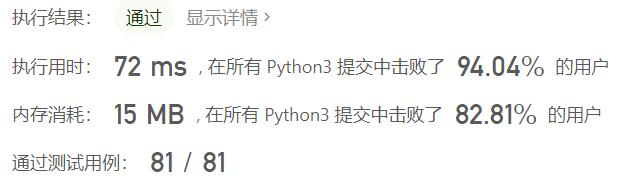
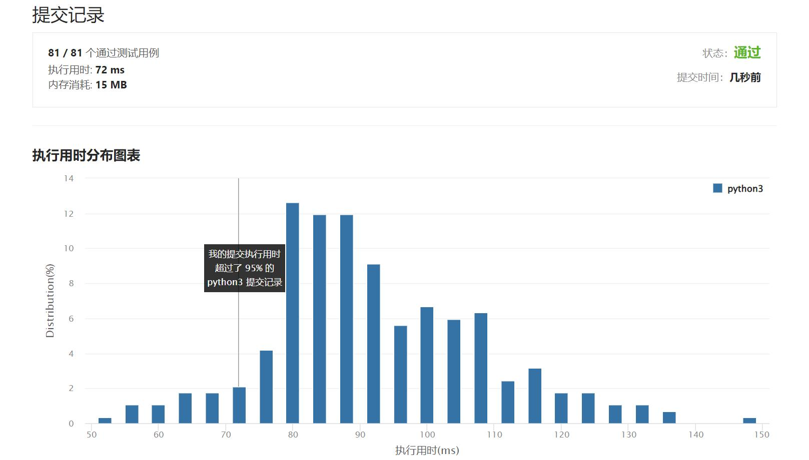

# 467-环绕字符串中唯一的子字符串

Author：_Mumu

创建日期：2022/05/25

通过日期：2022/05/25

*****

踩过的坑：

1. 没注意到“唯一”啊
1. 题解方法统计以字符结尾的子字符串个数其实和统计以字符开头是等价的，只不过实现上从前往后遍历前者更方便

已解决：350/2647

*****

难度：中等

问题描述：

把字符串 s 看作是 “abcdefghijklmnopqrstuvwxyz” 的无限环绕字符串，所以 s 看起来是这样的：

"...zabcdefghijklmnopqrstuvwxyzabcdefghijklmnopqrstuvwxyzabcd...." . 
现在给定另一个字符串 p 。返回 s 中 唯一 的 p 的 非空子串 的数量 。 

 

示例 1:

输入: p = "a"
输出: 1
解释: 字符串 s 中只有一个"a"子字符。
示例 2:

输入: p = "cac"
输出: 2
解释: 字符串 s 中的字符串“cac”只有两个子串“a”、“c”。.
示例 3:

输入: p = "zab"
输出: 6
解释: 在字符串 s 中有六个子串“z”、“a”、“b”、“za”、“ab”、“zab”。

提示:

1 <= p.length <= 105
p 由小写英文字母构成

来源：力扣（LeetCode）
链接：https://leetcode.cn/problems/unique-substrings-in-wraparound-string