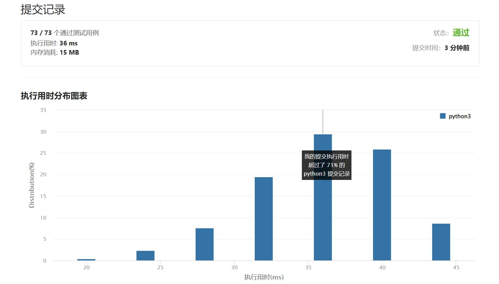

# 468-验证IP地址

Author：_Mumu

创建日期：2022/05/29

通过日期：2022/05/29

*****

踩过的坑：

1. 轻松愉快

已解决：354/2652

*****

难度：中等

问题描述：

给定一个字符串 queryIP。如果是有效的 IPv4 地址，返回 "IPv4" ；如果是有效的 IPv6 地址，返回 "IPv6" ；如果不是上述类型的 IP 地址，返回 "Neither" 。

有效的IPv4地址 是 “x1.x2.x3.x4” 形式的IP地址。 其中 0 <= xi <= 255 且 xi 不能包含 前导零。例如: “192.168.1.1” 、 “192.168.1.0” 为有效IPv4地址， “192.168.01.1” 为无效IPv4地址; “192.168.1.00” 、 “192.168@1.1” 为无效IPv4地址。

一个有效的IPv6地址 是一个格式为“x1:x2:x3:x4:x5:x6:x7:x8” 的IP地址，其中:

1 <= xi.length <= 4
xi 是一个 十六进制字符串 ，可以包含数字、小写英文字母( 'a' 到 'f' )和大写英文字母( 'A' 到 'F' )。
在 xi 中允许前导零。
例如 "2001:0db8:85a3:0000:0000:8a2e:0370:7334" 和 "2001:db8:85a3:0:0:8A2E:0370:7334" 是有效的 IPv6 地址，而 "2001:0db8:85a3::8A2E:037j:7334" 和 "02001:0db8:85a3:0000:0000:8a2e:0370:7334" 是无效的 IPv6 地址。

 

示例 1：

输入：queryIP = "172.16.254.1"
输出："IPv4"
解释：有效的 IPv4 地址，返回 "IPv4"
示例 2：

输入：queryIP = "2001:0db8:85a3:0:0:8A2E:0370:7334"
输出："IPv6"
解释：有效的 IPv6 地址，返回 "IPv6"
示例 3：

输入：queryIP = "256.256.256.256"
输出："Neither"
解释：既不是 IPv4 地址，又不是 IPv6 地址

提示：

queryIP 仅由英文字母，数字，字符 '.' 和 ':' 组成。

来源：力扣（LeetCode）
链接：https://leetcode.cn/problems/validate-ip-address