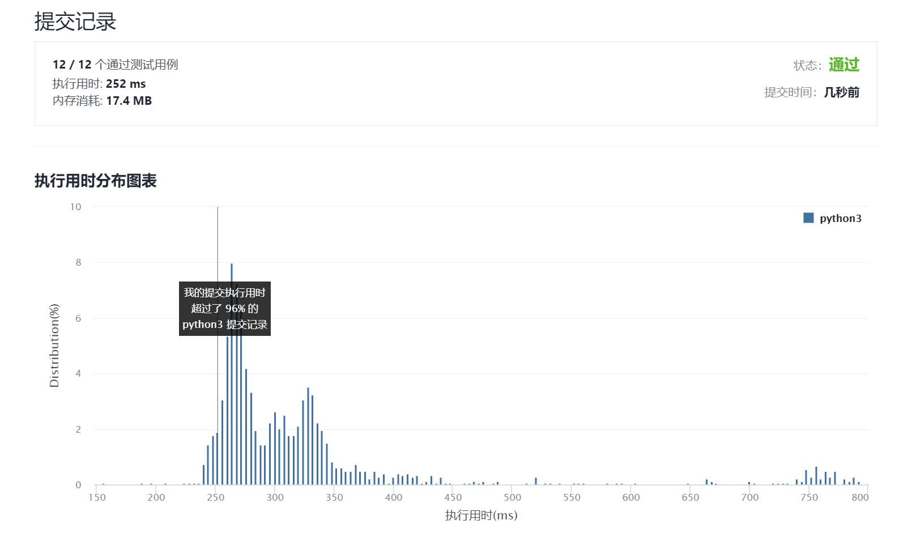

# 470-用Rand7()实现Rand10()

Author：_Mumu

创建日期：2021/9/5

通过日期：2021/9/5

*****

踩过的坑：

1. ummmm，本来以为可以通过一些数学上的操作把事件分割为10份
2. 结果看题解才知道居然是拒绝样本，蛮牛的，学习了

已解决：79/2342

*****

难度：中等

问题描述：

已有方法 rand7 可生成 1 到 7 范围内的均匀随机整数，试写一个方法 rand10 生成 1 到 10 范围内的均匀随机整数。

不要使用系统的 Math.random() 方法。

 

示例 1:

输入: 1
输出: [7]
示例 2:

输入: 2
输出: [8,4]
示例 3:

输入: 3
输出: [8,1,10]

提示:

rand7 已定义。
传入参数: n 表示 rand10 的调用次数。

进阶:

rand7()调用次数的 期望值 是多少 ?
你能否尽量少调用 rand7() ?

来源：力扣（LeetCode）
链接：https://leetcode-cn.com/problems/implement-rand10-using-rand7
