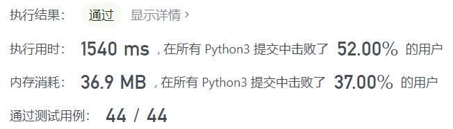
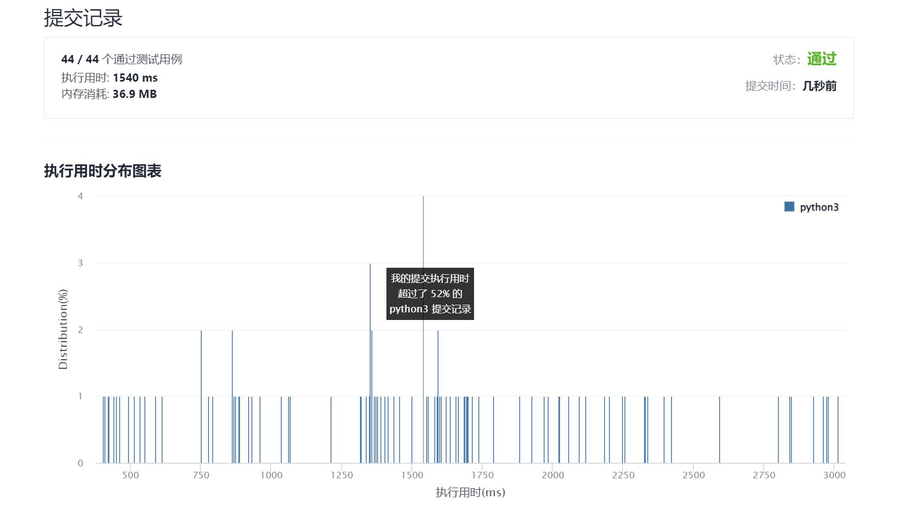

# 472-连接词

Author：_Mumu

创建日期：2021/12/28

通过日期：2021/12/28

*****

踩过的坑：

1. 草
2. 字典树+深度优先搜索的方向找对了，能做出来
3. 但是由于把所有连接词也塞进了字典，导致判断连接词的时间大幅延长
4. 没想到应该在最开始先按长度排序，然后只把非连接词加入字典，连接词直接加入答案
5. 加个排序直接就过了。。

已解决：190/2477

*****

难度：困难

问题描述：

给你一个 不含重复 单词的字符串数组 words ，请你找出并返回 words 中的所有 连接词 。

连接词 定义为：一个完全由给定数组中的至少两个较短单词组成的字符串。

 

示例 1：

输入：words = ["cat","cats","catsdogcats","dog","dogcatsdog","hippopotamuses","rat","ratcatdogcat"]
输出：["catsdogcats","dogcatsdog","ratcatdogcat"]
解释："catsdogcats" 由 "cats", "dog" 和 "cats" 组成; 
     "dogcatsdog" 由 "dog", "cats" 和 "dog" 组成; 
     "ratcatdogcat" 由 "rat", "cat", "dog" 和 "cat" 组成。
示例 2：

输入：words = ["cat","dog","catdog"]
输出：["catdog"]

提示：

1 <= words.length <= 104
0 <= words[i].length <= 1000
words[i] 仅由小写字母组成
0 <= sum(words[i].length) <= 105

来源：力扣（LeetCode）
链接：https://leetcode-cn.com/problems/concatenated-words
