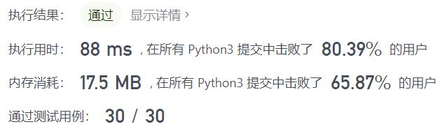
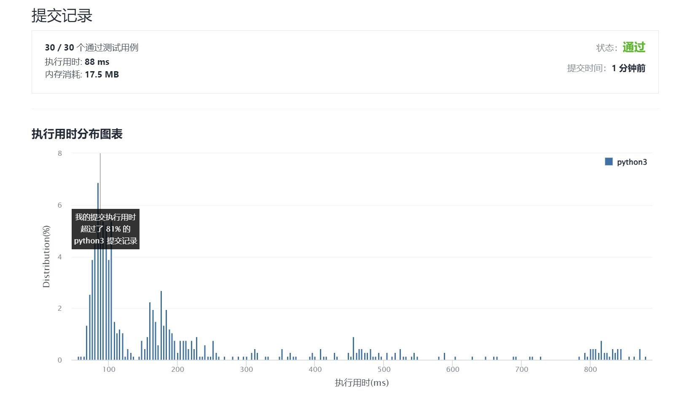

# 475-供暖器

Author：_Mumu

创建日期：2021/12/20

通过日期：2021/12/20

*****

踩过的坑：

1. 遇事不决先`sort()`，然后双指针搜索就很舒服了
2. 希望大家都能幸福快乐平安
3. 这是个过大的梦想
4. 所以首先为了一个理想努力吧
5. 希望我能够幸福快乐平安

已解决：182/2467

*****

难度：中等

问题描述：

冬季已经来临。 你的任务是设计一个有固定加热半径的供暖器向所有房屋供暖。

在加热器的加热半径范围内的每个房屋都可以获得供暖。

现在，给出位于一条水平线上的房屋 houses 和供暖器 heaters 的位置，请你找出并返回可以覆盖所有房屋的最小加热半径。

说明：所有供暖器都遵循你的半径标准，加热的半径也一样。

 

示例 1:

输入: houses = [1,2,3], heaters = [2]
输出: 1
解释: 仅在位置2上有一个供暖器。如果我们将加热半径设为1，那么所有房屋就都能得到供暖。
示例 2:

输入: houses = [1,2,3,4], heaters = [1,4]
输出: 1
解释: 在位置1, 4上有两个供暖器。我们需要将加热半径设为1，这样所有房屋就都能得到供暖。
示例 3：

输入：houses = [1,5], heaters = [2]
输出：3

提示：

1 <= houses.length, heaters.length <= 3 * 104
1 <= houses[i], heaters[i] <= 109

来源：力扣（LeetCode）
链接：https://leetcode-cn.com/problems/heaters
