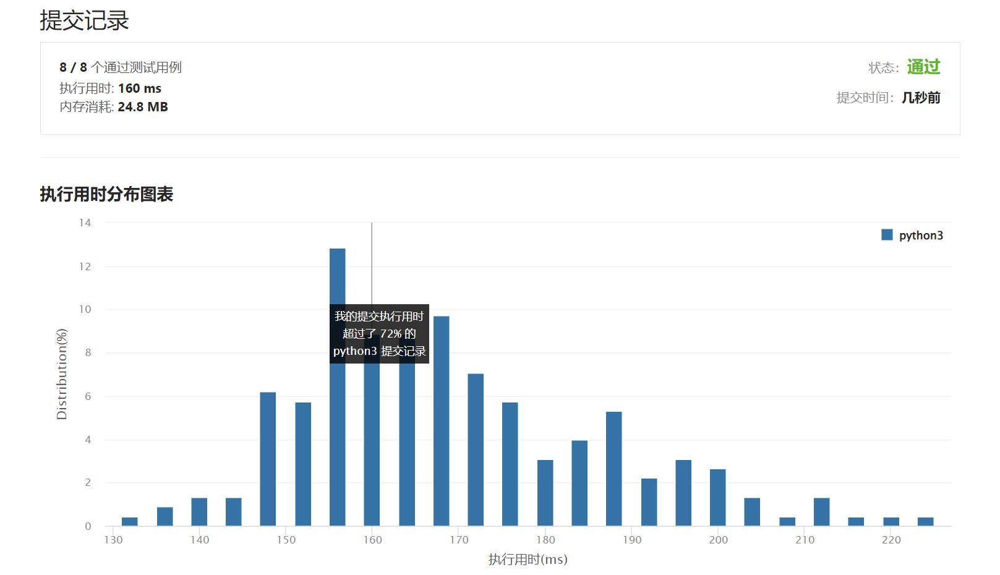

# 478-在圆内随机生成点

Author：_Mumu

创建日期：2022/06/05

通过日期：2022/06/05

*****

踩过的坑：

1. 轻松愉快

已解决：361/2658

*****

难度：中等

问题描述：

给定圆的半径和圆心的位置，实现函数 randPoint ，在圆中产生均匀随机点。

实现 Solution 类:

Solution(double radius, double x_center, double y_center) 用圆的半径 radius 和圆心的位置 (x_center, y_center) 初始化对象
randPoint() 返回圆内的一个随机点。圆周上的一点被认为在圆内。答案作为数组返回 [x, y] 。

示例 1：

输入: 
["Solution","randPoint","randPoint","randPoint"]
[[1.0, 0.0, 0.0], [], [], []]
输出: [null, [-0.02493, -0.38077], [0.82314, 0.38945], [0.36572, 0.17248]]
解释:
Solution solution = new Solution(1.0, 0.0, 0.0);
solution.randPoint ();//返回[-0.02493，-0.38077]
solution.randPoint ();//返回[0.82314,0.38945]
solution.randPoint ();//返回[0.36572,0.17248]

提示：

0 < radius <= 108
-107 <= x_center, y_center <= 107
randPoint 最多被调用 3 * 104 次

来源：力扣（LeetCode）
链接：https://leetcode.cn/problems/generate-random-point-in-a-circle