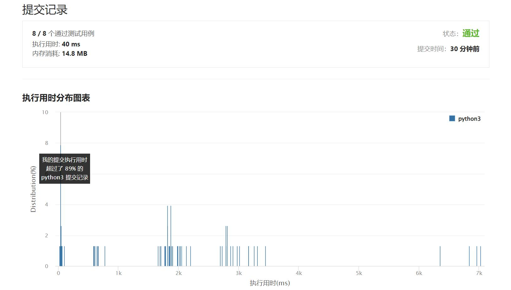

# 479-最大回文数乘积

Author：_Mumu

创建日期：2022/04/16

通过日期：2022/04/16

*****

踩过的坑：

1. 轻松愉快（指直接打表

已解决：311/2593

*****

难度：困难

问题描述：

给定一个整数 n ，返回 可表示为两个 n 位整数乘积的 最大回文整数 。因为答案可能非常大，所以返回它对 1337 取余 。

 

示例 1:

输入：n = 2
输出：987
解释：99 x 91 = 9009, 9009 % 1337 = 987
示例 2:

输入： n = 1
输出： 9

提示:

1 <= n <= 8

来源：力扣（LeetCode）
链接：https://leetcode-cn.com/problems/largest-palindrome-product