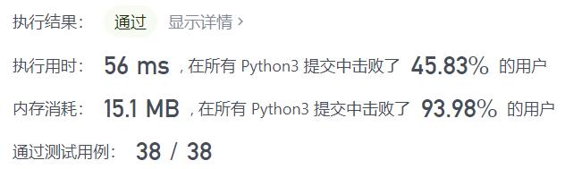
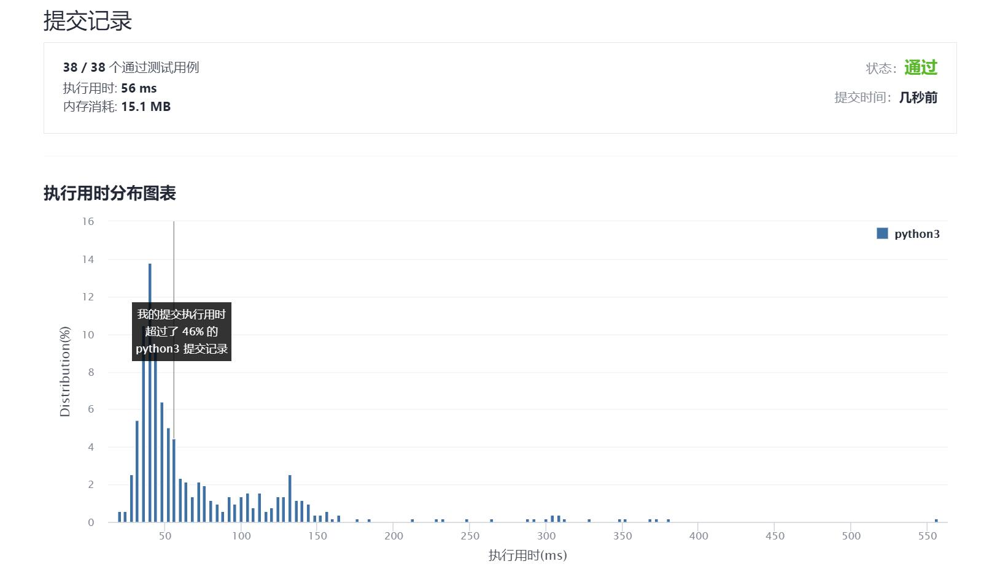

# 482-密钥格式化

Author：_Mumu

创建日期：2021/10/4

通过日期：2021/10/4

*****

踩过的坑：

1. 记得取大写！！！
2. 妙啊
3. 又是对着精妙写法666的一天
4. 题目中规中矩，思路很简单，正着来的话细节处理比较复杂，反着来的话可以写得比较简便，但是由于python字符串不能删改，所以必须用列表先存储防止余数为0时最后多了一个`'-'`的情况，但是这样就导致存储空间较大
5. 我一开始只想到了正着来，空间占用确实不大，细节处理是真的烦，而且也更慢一些
6. 然后看到最快的写法
7. 行吧，大佬总是能惊艳到我
8. 直接用方法`str.replace()`把`'-'`替换为空字符，再取反向取大写
9. 然后利用切片的性质：结束位置就算超出范围也没事，就不用分别处理第一组和之后的组，分割每组字符串存入列表
10. 最后再用`'-'.join()`连接，取反向输出
11. 果然还是好好利用现有的库更牛逼啊
12. 妙啊

已解决：106/2385

*****

难度：简单

问题描述：

有一个密钥字符串 S ，只包含字母，数字以及 '-'（破折号）。其中， N 个 '-' 将字符串分成了 N+1 组。

给你一个数字 K，请你重新格式化字符串，使每个分组恰好包含 K 个字符。特别地，第一个分组包含的字符个数必须小于等于 K，但至少要包含 1 个字符。两个分组之间需要用 '-'（破折号）隔开，并且将所有的小写字母转换为大写字母。

给定非空字符串 S 和数字 K，按照上面描述的规则进行格式化。

 

示例 1：

输入：S = "5F3Z-2e-9-w", K = 4
输出："5F3Z-2E9W"
解释：字符串 S 被分成了两个部分，每部分 4 个字符；
     注意，两个额外的破折号需要删掉。
示例 2：

输入：S = "2-5g-3-J", K = 2
输出："2-5G-3J"
解释：字符串 S 被分成了 3 个部分，按照前面的规则描述，第一部分的字符可以少于给定的数量，其余部分皆为 2 个字符。

提示:

S 的长度可能很长，请按需分配大小。K 为正整数。
S 只包含字母数字（a-z，A-Z，0-9）以及破折号'-'
S 非空

来源：力扣（LeetCode）
链接：https://leetcode-cn.com/problems/license-key-formatting
