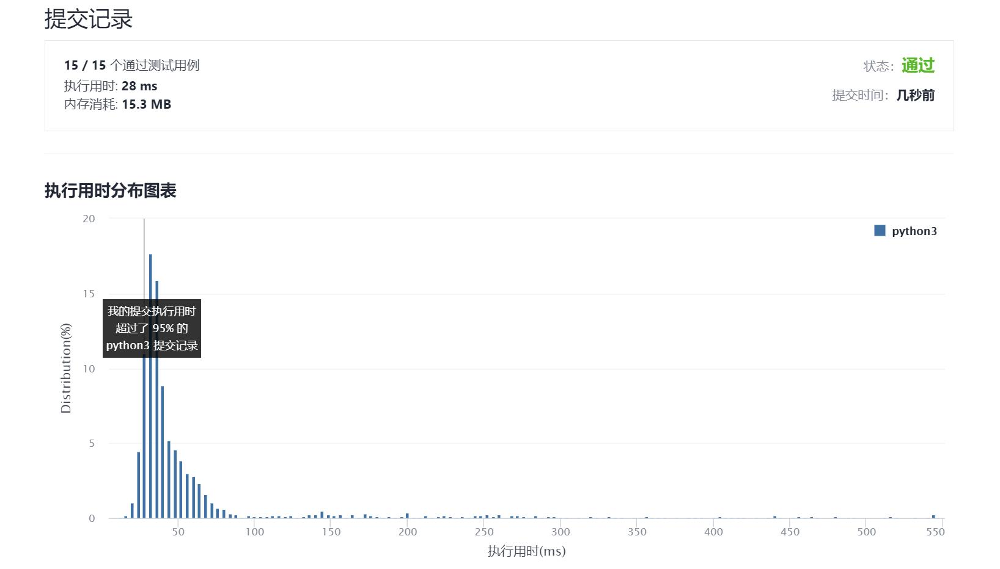

# 496-下一个更大元素I

Author：_Mumu

创建日期：2021/10/26

通过日期：2021/10/26

*****

踩过的坑：

1. 单调栈牛啊！
2. 从后往前遍历序列，弹出栈顶小于当前值的元素，此时栈顶必为当前值之后第一个比当前值更大的元素，再将当前值入栈，继续操作即可

已解决：129/2406

*****

难度：简单

问题描述：

给你两个 没有重复元素 的数组 nums1 和 nums2 ，其中nums1 是 nums2 的子集。

请你找出 nums1 中每个元素在 nums2 中的下一个比其大的值。

nums1 中数字 x 的下一个更大元素是指 x 在 nums2 中对应位置的右边的第一个比 x 大的元素。如果不存在，对应位置输出 -1 。

 

示例 1:

输入: nums1 = [4,1,2], nums2 = [1,3,4,2].
输出: [-1,3,-1]
解释:
    对于 num1 中的数字 4 ，你无法在第二个数组中找到下一个更大的数字，因此输出 -1 。
    对于 num1 中的数字 1 ，第二个数组中数字1右边的下一个较大数字是 3 。
    对于 num1 中的数字 2 ，第二个数组中没有下一个更大的数字，因此输出 -1 。
示例 2:

输入: nums1 = [2,4], nums2 = [1,2,3,4].
输出: [3,-1]
解释:
    对于 num1 中的数字 2 ，第二个数组中的下一个较大数字是 3 。
    对于 num1 中的数字 4 ，第二个数组中没有下一个更大的数字，因此输出 -1 。

提示：

1 <= nums1.length <= nums2.length <= 1000
0 <= nums1[i], nums2[i] <= 104
nums1和nums2中所有整数 互不相同
nums1 中的所有整数同样出现在 nums2 中

进阶：你可以设计一个时间复杂度为 O(nums1.length + nums2.length) 的解决方案吗？

来源：力扣（LeetCode）
链接：https://leetcode-cn.com/problems/next-greater-element-i
