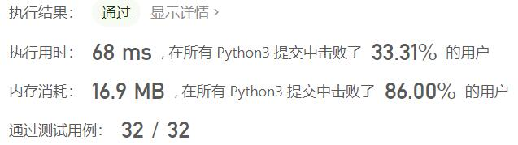
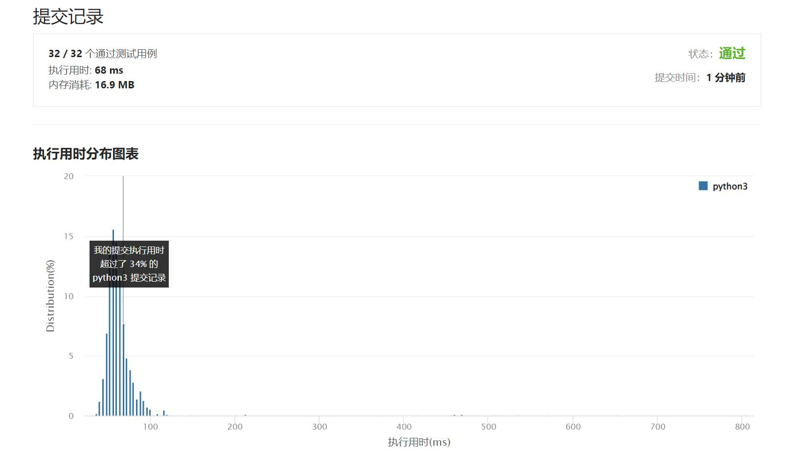

# 498-对角线遍历

Author：_Mumu

创建日期：2022/06/14

通过日期：2022/06/14

*****

踩过的坑：

1. 轻松愉快

已解决：370/2672

*****

难度：中等

问题描述：

给你一个大小为 m x n 的矩阵 mat ，请以对角线遍历的顺序，用一个数组返回这个矩阵中的所有元素。

 

示例 1：

输入：mat = [[1,2,3],[4,5,6],[7,8,9]]
输出：[1,2,4,7,5,3,6,8,9]
示例 2：

输入：mat = [[1,2],[3,4]]
输出：[1,2,3,4]

提示：

m == mat.length
n == mat[i].length
1 <= m, n <= 104
1 <= m * n <= 104
-105 <= mat[i][j] <= 105

来源：力扣（LeetCode）
链接：https://leetcode.cn/problems/diagonal-traverse