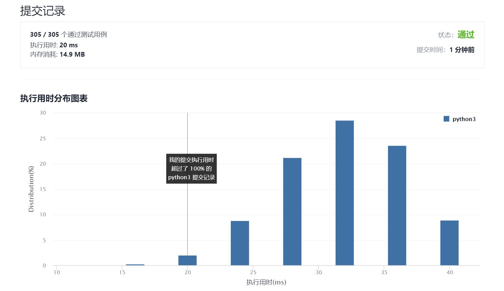

# 50-Pow(x,n)

Author：_Mumu

创建日期：2021/10/12

通过日期：2021/10/12

*****

踩过的坑：

1. 充分利用位运算，与题解的迭代算法是一致的，舒服

已解决：115/2390

*****

难度：中等

问题描述：

实现 pow(x, n) ，即计算 x 的 n 次幂函数（即，xn）。

 

示例 1：

输入：x = 2.00000, n = 10
输出：1024.00000
示例 2：

输入：x = 2.10000, n = 3
输出：9.26100
示例 3：

输入：x = 2.00000, n = -2
输出：0.25000
解释：2-2 = 1/22 = 1/4 = 0.25

提示：

-100.0 < x < 100.0
-231 <= n <= 231-1
-104 <= xn <= 104

来源：力扣（LeetCode）
链接：https://leetcode-cn.com/problems/powx-n
