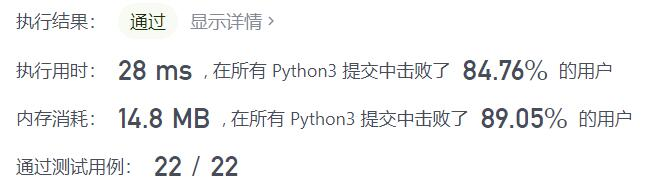
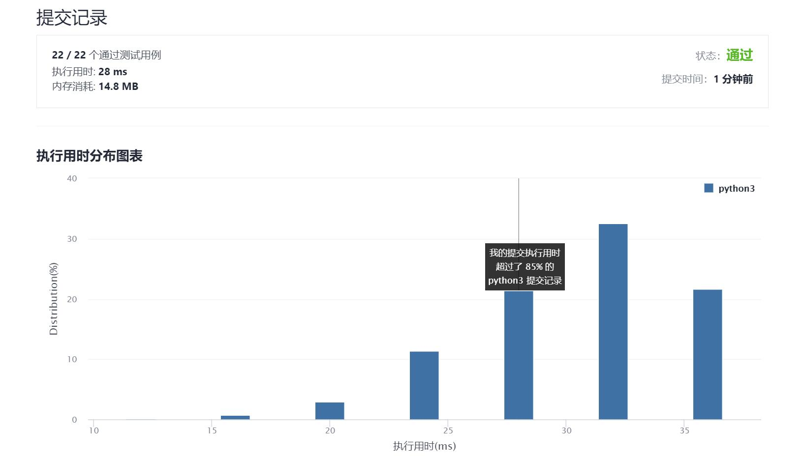

# 500-键盘行

Author：_Mumu

创建日期：2021/10/31

通过日期：2021/10/31

*****

踩过的坑：

1. 只能说简单粗暴，遍历就完了
2. 为什么今天只做了一题进度却多了四题呢~
3. 因为今天尝试了一个模拟竞赛！做了三道题，嘿嘿

已解决：137/2415

*****

难度：简单

问题描述：

给你一个字符串数组 words ，只返回可以使用在 美式键盘 同一行的字母打印出来的单词。键盘如下图所示。

美式键盘 中：

第一行由字符 "qwertyuiop" 组成。
第二行由字符 "asdfghjkl" 组成。
第三行由字符 "zxcvbnm" 组成。

示例 1：

输入：words = ["Hello","Alaska","Dad","Peace"]
输出：["Alaska","Dad"]
示例 2：

输入：words = ["omk"]
输出：[]
示例 3：

输入：words = ["adsdf","sfd"]
输出：["adsdf","sfd"]

提示：

1 <= words.length <= 20
1 <= words[i].length <= 100
words[i] 由英文字母（小写和大写字母）组成

来源：力扣（LeetCode）
链接：https://leetcode-cn.com/problems/keyboard-row
