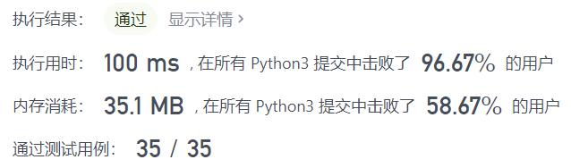
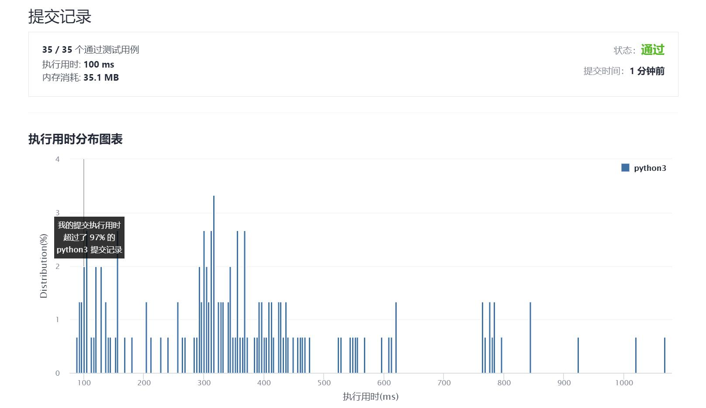

# 502-IPO

Author：_Mumu

创建日期：2021/9/8

通过日期：2021/9/8

*****

踩过的坑：

1. 初看感觉超复杂，完全想不出该怎么做，甚至题意都没有理解清楚，直接看题解去了
2. 看了题解就豁然开朗了，按照题解实现也很容易
3. 用堆的好处在于方便维护最大值，并且方便弹出，保证选取项目各不相同
4. 需要注意的是，题目所给的并不是排好序的数据，所以需要自行排序
5. 另外，初始财富大于项目启动资金最大值的情况可以直接返回`w + nlargest(k, profits)`不必再进行计算，`nlargest`是`heapq`中的一个函数

已解决：84/2342

*****

难度：困难

问题描述：

假设 力扣（LeetCode）即将开始 IPO 。为了以更高的价格将股票卖给风险投资公司，力扣 希望在 IPO 之前开展一些项目以增加其资本。 由于资源有限，它只能在 IPO 之前完成最多 k 个不同的项目。帮助 力扣 设计完成最多 k 个不同项目后得到最大总资本的方式。

给你 n 个项目。对于每个项目 i ，它都有一个纯利润 profits[i] ，和启动该项目需要的最小资本 capital[i] 。

最初，你的资本为 w 。当你完成一个项目时，你将获得纯利润，且利润将被添加到你的总资本中。

总而言之，从给定项目中选择 最多 k 个不同项目的列表，以 最大化最终资本 ，并输出最终可获得的最多资本。

答案保证在 32 位有符号整数范围内。

 

示例 1：

输入：k = 2, w = 0, profits = [1,2,3], capital = [0,1,1]
输出：4
解释：
由于你的初始资本为 0，你仅可以从 0 号项目开始。
在完成后，你将获得 1 的利润，你的总资本将变为 1。
此时你可以选择开始 1 号或 2 号项目。
由于你最多可以选择两个项目，所以你需要完成 2 号项目以获得最大的资本。
因此，输出最后最大化的资本，为 0 + 1 + 3 = 4。
示例 2：

输入：k = 3, w = 0, profits = [1,2,3], capital = [0,1,2]
输出：6

提示：

1 <= k <= 105
0 <= w <= 109
n == profits.length
n == capital.length
1 <= n <= 105
0 <= profits[i] <= 104
0 <= capital[i] <= 109

来源：力扣（LeetCode）
链接：https://leetcode-cn.com/problems/ipo
