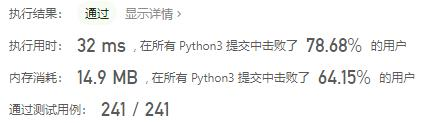
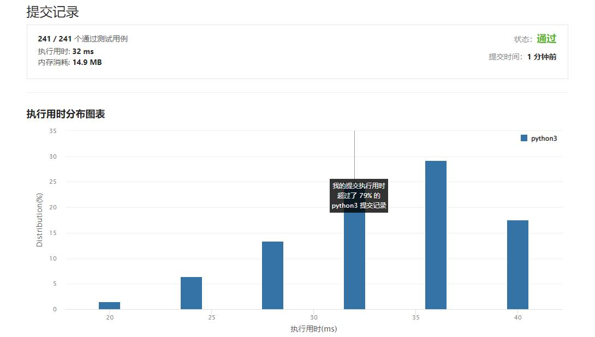

# 504-七进制数

Author：_Mumu

创建日期：2022/03/07

通过日期：2022/03/07

*****

踩过的坑：

1. 轻松愉快

已解决：271/2552

*****

难度：简单

问题描述：

给定一个整数 num，将其转化为 7 进制，并以字符串形式输出。

 

示例 1:

输入: num = 100
输出: "202"
示例 2:

输入: num = -7
输出: "-10"

提示：

-107 <= num <= 107

来源：力扣（LeetCode）
链接：https://leetcode-cn.com/problems/base-7