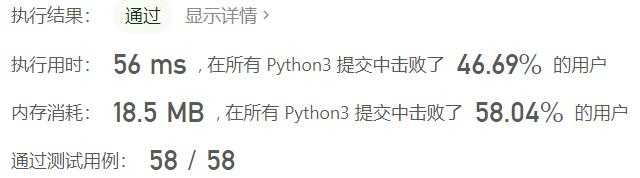
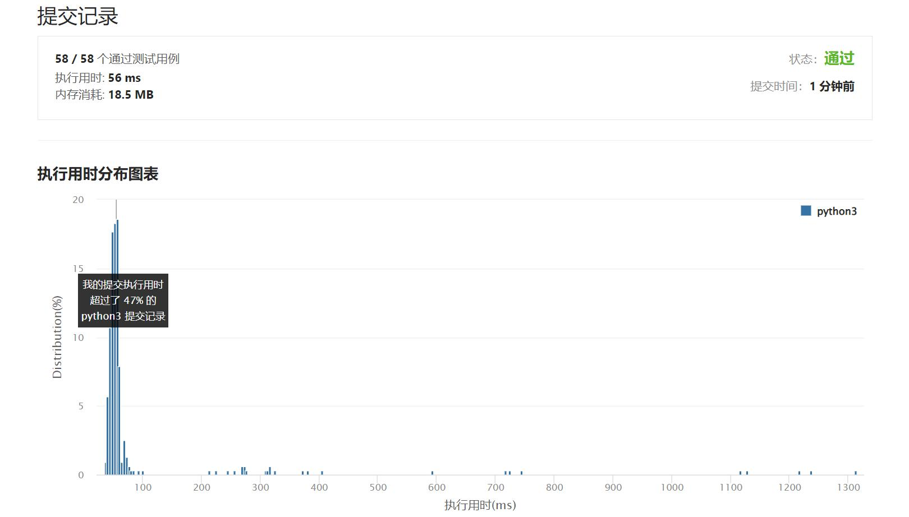

# 508-出现次数最多的子树元素和

Author：_Mumu

创建日期：2022/06/19

通过日期：2022/06/19

*****

踩过的坑：

1. 轻松愉快
1. 二叉树子树和就是简单的dfs了啦

已解决：374/2678

*****

难度：中等

问题描述：

给你一个二叉树的根结点 root ，请返回出现次数最多的子树元素和。如果有多个元素出现的次数相同，返回所有出现次数最多的子树元素和（不限顺序）。

一个结点的 「子树元素和」 定义为以该结点为根的二叉树上所有结点的元素之和（包括结点本身）。

 

示例 1：

输入: root = [5,2,-3]
输出: [2,-3,4]
示例 2：

输入: root = [5,2,-5]
输出: [2]

提示:

节点数在 [1, 104] 范围内
-105 <= Node.val <= 105

来源：力扣（LeetCode）
链接：https://leetcode.cn/problems/most-frequent-subtree-sum