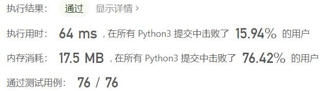
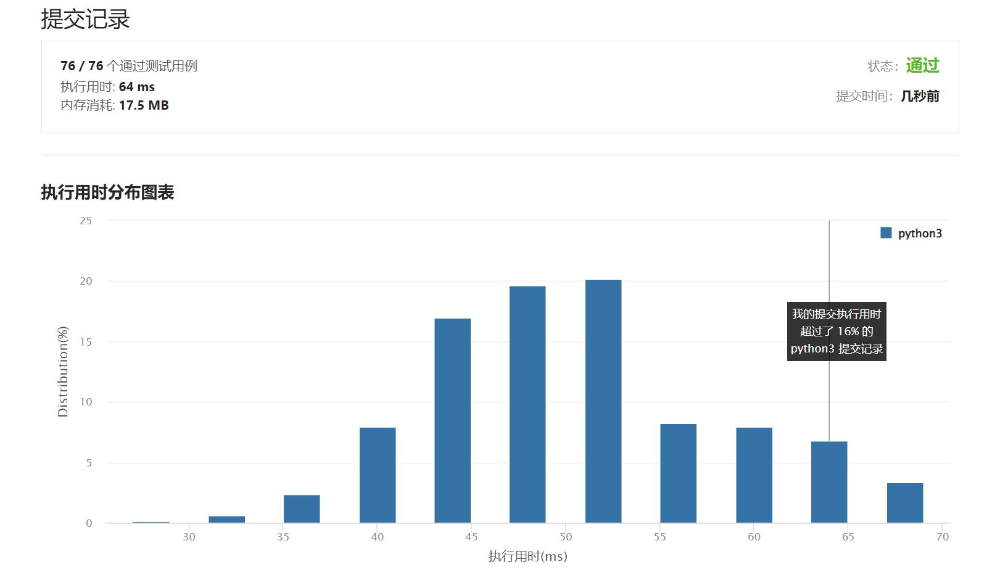

# 513-找树左下角的值

Author：_Mumu

创建日期：2022/06/22

通过日期：2022/06/22

*****

踩过的坑：

1. 轻松愉快
1. 简单的bfs

已解决：377/2678

*****

难度：中等

问题描述：

给定一个二叉树的 根节点 root，请找出该二叉树的 最底层 最左边 节点的值。

假设二叉树中至少有一个节点。

 

示例 1:

输入: root = [2,1,3]
输出: 1
示例 2:

输入: [1,2,3,4,null,5,6,null,null,7]
输出: 7

提示:

二叉树的节点个数的范围是 [1,104]
-231 <= Node.val <= 231 - 1 

来源：力扣（LeetCode）
链接：https://leetcode.cn/problems/find-bottom-left-tree-value