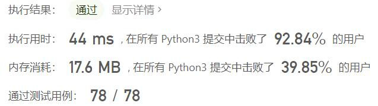
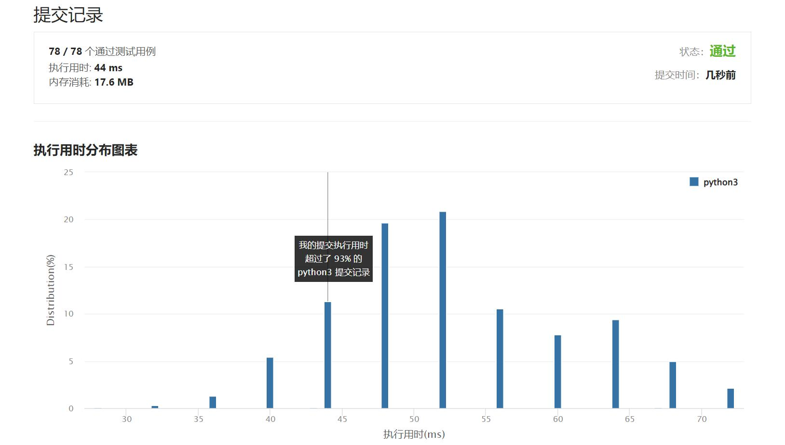

# 515-在每个树行中找最大值

Author：_Mumu

创建日期：2022/06/24

通过日期：2022/06/24

*****

踩过的坑：

1. 轻松愉快
1. 简单的bfs

已解决：379/2680

*****

难度：中等

问题描述：

给定一棵二叉树的根节点 root ，请找出该二叉树中每一层的最大值。

 

示例1：

输入: root = [1,3,2,5,3,null,9]
输出: [1,3,9]
示例2：

输入: root = [1,2,3]
输出: [1,3]

提示：

二叉树的节点个数的范围是 [0,104]
-231 <= Node.val <= 231 - 1

来源：力扣（LeetCode）
链接：https://leetcode.cn/problems/find-largest-value-in-each-tree-row