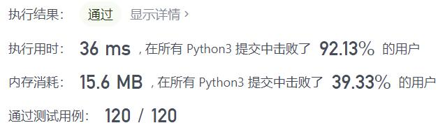
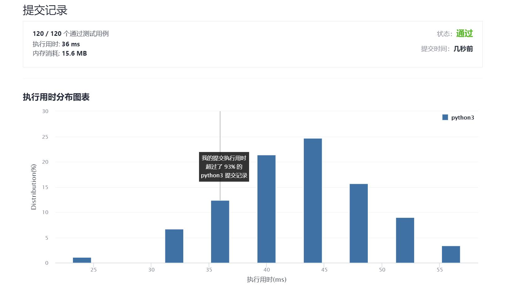

# 517-超级洗衣机

Author：_Mumu

创建日期：2021/9/29

通过日期：2021/9/29

*****

踩过的坑：

1. 暴力解确实8行啊，随便一个大数字就直接超时了
2. 说实话题解方法现在还是有点懵
3. 大致思路是排除不可均分的情况后，记均分后数量为`avg`，记`diff[i] = machines[i] - avg`，记`sum[i]`为`diff[i]`的前缀和
4. 假设下标`i`把`machines`分为`machines[:i+1]`和`machine[i+1:]`两组，由于一次操作最多在两组间移动一件衣服，则`abs(sum[i])`为这两组间平衡衣服数量需要的最少的操作次数，取其最大值为平衡左右所需最少的步数
5. 若位于中间的某台洗衣机衣服数量过多，上述操作不足以达到平衡，还应取`diff[i]`最大值，并取其和上述的最大值之中的更大者，由此得到每台机器最小运输衣服数量的最大值
6. 而该值正是实际所需最小操作次数，证明详见宫水三叶题解

已解决：101/2375

*****

难度：困难

问题描述：

假设有 n 台超级洗衣机放在同一排上。开始的时候，每台洗衣机内可能有一定量的衣服，也可能是空的。

在每一步操作中，你可以选择任意 m (1 <= m <= n) 台洗衣机，与此同时将每台洗衣机的一件衣服送到相邻的一台洗衣机。

给定一个整数数组 machines 代表从左至右每台洗衣机中的衣物数量，请给出能让所有洗衣机中剩下的衣物的数量相等的 最少的操作步数 。如果不能使每台洗衣机中衣物的数量相等，则返回 -1 。

 

示例 1：

输入：machines = [1,0,5]
输出：3
解释：
第一步:    1     0 <-- 5    =>    1     1     4
第二步:    1 <-- 1 <-- 4    =>    2     1     3    
第三步:    2     1 <-- 3    =>    2     2     2   
示例 2：

输入：machines = [0,3,0]
输出：2
解释：
第一步:    0 <-- 3     0    =>    1     2     0    
第二步:    1     2 --> 0    =>    1     1     1     
示例 3：

输入：machines = [0,2,0]
输出：-1
解释：
不可能让所有三个洗衣机同时剩下相同数量的衣物。

提示：

n == machines.length
1 <= n <= 104
0 <= machines[i] <= 105

来源：力扣（LeetCode）
链接：https://leetcode-cn.com/problems/super-washing-machines
