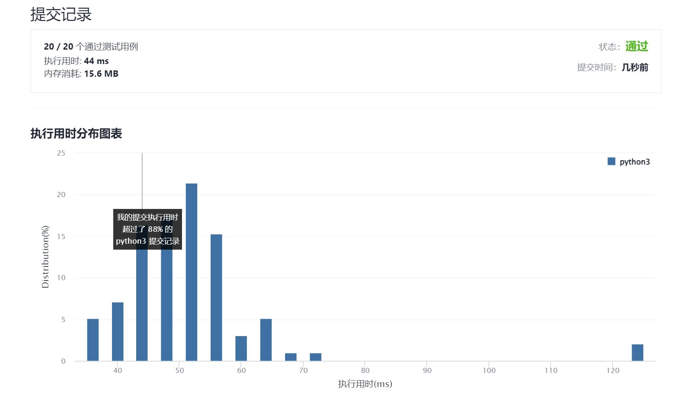

# 519-随机翻转矩阵

Author：_Mumu

创建日期：2021/11/27

通过日期：2021/11/27

*****

踩过的坑：

1. 妙啊
2. 使用前$m\times n$个正整数一一对应到矩阵的每个元素，假设有一个映射$f(i)=i,\forall i\in\{1,...,m\times n\}$，假设正整数$k$初始值为$m\times n$，每次抽取只在前$k$个整数中抽，抽到的数字设为$j$，则修改映射$f(j)=f(k)$，令$k=k-1$，返回坐标$(\lfloor \frac{j-1}{n}\rfloor,j-1-\lfloor \frac{j-1}{n}\rfloor\times n)$
3. 在python中实现时，可以使用字典（哈希表）`map: dict`存储映射，只需存储被改变过映射值的整数即可，使用`map.get(j, default=j)`便可在数字`j`的映射被修改时取出映射值，未被修改时返回默认的`j`，修改映射时则使用`map[j] = map.get(k, k)`，注意到若`j == k`，那么下次抽取`k`一定不会再被抽到，此时无需消耗多余空间存储映射，若`k in map`，可以考虑清除关于`k`的映射释放空间，返回的坐标为`[(j - 1) // n, (j - 1) % n]`

已解决：159/2439

*****

难度：中等

问题描述：

给你一个 m x n 的二元矩阵 matrix ，且所有值被初始化为 0 。请你设计一个算法，随机选取一个满足 matrix[i][j] == 0 的下标 (i, j) ，并将它的值变为 1 。所有满足 matrix[i][j] == 0 的下标 (i, j) 被选取的概率应当均等。

尽量最少调用内置的随机函数，并且优化时间和空间复杂度。

实现 Solution 类：

Solution(int m, int n) 使用二元矩阵的大小 m 和 n 初始化该对象
int[] flip() 返回一个满足 matrix[i][j] == 0 的随机下标 [i, j] ，并将其对应格子中的值变为 1
void reset() 将矩阵中所有的值重置为 0

示例：

输入
["Solution", "flip", "flip", "flip", "reset", "flip"]
[[3, 1], [], [], [], [], []]
输出
[null, [1, 0], [2, 0], [0, 0], null, [2, 0]]

解释
Solution solution = new Solution(3, 1);
solution.flip();  // 返回 [1, 0]，此时返回 [0,0]、[1,0] 和 [2,0] 的概率应当相同
solution.flip();  // 返回 [2, 0]，因为 [1,0] 已经返回过了，此时返回 [2,0] 和 [0,0] 的概率应当相同
solution.flip();  // 返回 [0, 0]，根据前面已经返回过的下标，此时只能返回 [0,0]
solution.reset(); // 所有值都重置为 0 ，并可以再次选择下标返回
solution.flip();  // 返回 [2, 0]，此时返回 [0,0]、[1,0] 和 [2,0] 的概率应当相同

提示：

1 <= m, n <= 104
每次调用flip 时，矩阵中至少存在一个值为 0 的格子。
最多调用 1000 次 flip 和 reset 方法。

来源：力扣（LeetCode）
链接：https://leetcode-cn.com/problems/random-flip-matrix
