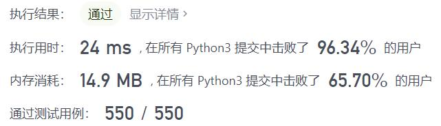
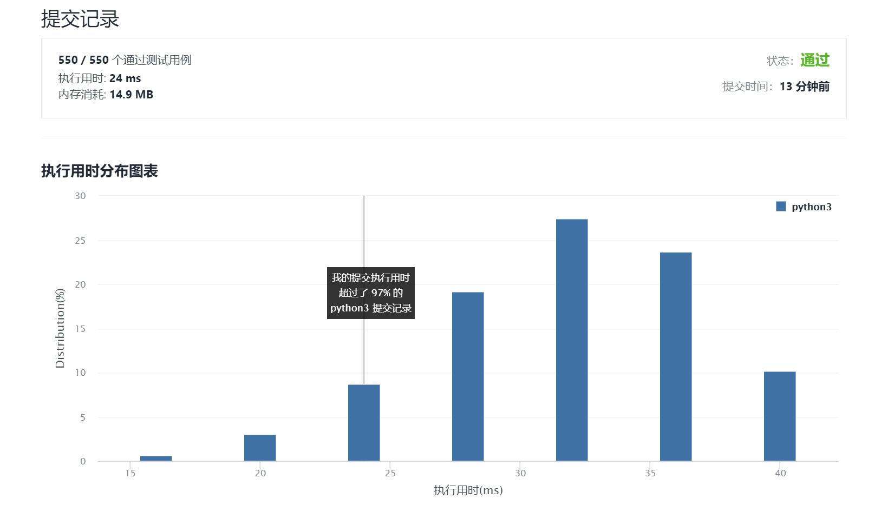

# 520-检测大写字母

Author：_Mumu

创建日期：2021/11/13

通过日期：2021/11/13

*****

踩过的坑：

1. 简单简单
2. 第一个和第二个字符大小写四种情况有三种情况成立，余下字符都与第二个字符相同才能成立
3. 学会了使用`str.isupper()`和`str.islower()`

已解决：147/2422

*****

难度：简单

问题描述：

我们定义，在以下情况时，单词的大写用法是正确的：

全部字母都是大写，比如 "USA" 。
单词中所有字母都不是大写，比如 "leetcode" 。
如果单词不只含有一个字母，只有首字母大写， 比如 "Google" 。
给你一个字符串 word 。如果大写用法正确，返回 true ；否则，返回 false 。

 

示例 1：

输入：word = "USA"
输出：true
示例 2：

输入：word = "FlaG"
输出：false

提示：

1 <= word.length <= 100
word 由小写和大写英文字母组成

来源：力扣（LeetCode）
链接：https://leetcode-cn.com/problems/detect-capital
