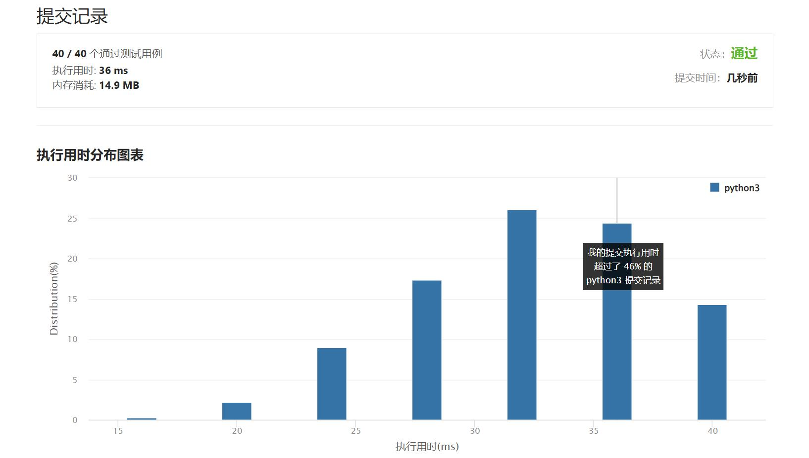

# 521-最长特殊序列Ⅰ

Author：_Mumu

创建日期：2022/03/05

通过日期：2022/03/05

*****

踩过的坑：

1. 轻松愉快
2. 如果不相等，那就是更长的那一个啊

已解决：269/2544

*****

难度：简单

问题描述：

给你两个字符串 a 和 b，请返回 这两个字符串中 最长的特殊序列  的长度。如果不存在，则返回 -1 。

「最长特殊序列」 定义如下：该序列为 某字符串独有的最长子序列（即不能是其他字符串的子序列） 。

字符串 s 的子序列是在从 s 中删除任意数量的字符后可以获得的字符串。

例如，"abc" 是 "aebdc" 的子序列，因为删除 "aebdc" 中斜体加粗的字符可以得到 "abc" 。 "aebdc" 的子序列还包括 "aebdc" 、 "aeb" 和 "" (空字符串)。

示例 1：

输入: a = "aba", b = "cdc"
输出: 3
解释: 最长特殊序列可为 "aba" (或 "cdc")，两者均为自身的子序列且不是对方的子序列。
示例 2：

输入：a = "aaa", b = "bbb"
输出：3
解释: 最长特殊序列是 "aaa" 和 "bbb" 。
示例 3：

输入：a = "aaa", b = "aaa"
输出：-1
解释: 字符串 a 的每个子序列也是字符串 b 的每个子序列。同样，字符串 b 的每个子序列也是字符串 a 的子序列。

提示：

1 <= a.length, b.length <= 100
a 和 b 由小写英文字母组成

来源：力扣（LeetCode）
链接：https://leetcode-cn.com/problems/longest-uncommon-subsequence-i