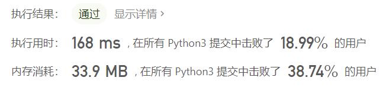
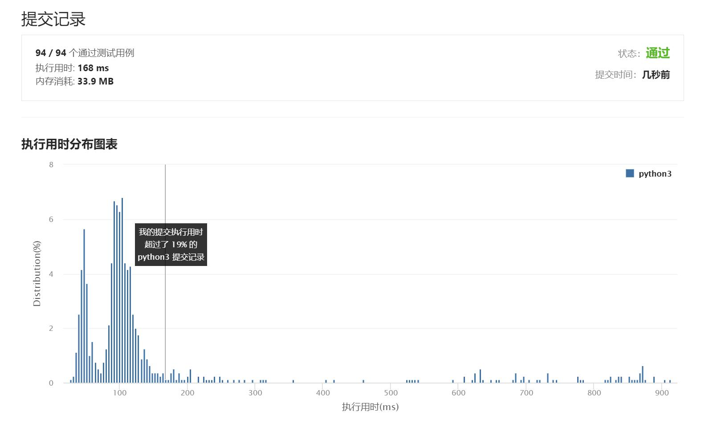

# 523-连续的子数组和

Author：_Mumu

创建日期：2021/6/2

通过日期：2021/6/2

*****

踩过的坑：

1. 想不出合适的解法，直接看题解了；
2. 第一眼看到前缀和，感觉可以算个前缀和然后每两项减一减取模，时间复杂度大概是$O(n^2)$；
3. 继续看就发现我还是太菜了，没想到可以直接拿前缀和的余数做文章；
4. 就这么搞着搞着居然能把这样一个看起来挺复杂的题的时间复杂度做到$O(n)$，精彩绝伦；
5. 另外有一个坑是，要注意前缀和余数各不相同但其中含有一个0不在列表首位的情况，可以在字典里预设`k_mod_first = {0: -1}`，或者加个余数0的位置≥1的判断（后者没前者好因为更慢）。

已解决：26/2106

*****

难度：中等

问题描述：

给你一个整数数组 nums 和一个整数 k ，编写一个函数来判断该数组是否含有同时满足下述条件的连续子数组：

子数组大小 至少为 2 ，且
子数组元素总和为 k 的倍数。
如果存在，返回 true ；否则，返回 false 。

如果存在一个整数 n ，令整数 x 符合 x = n * k ，则称 x 是 k 的一个倍数。

 

示例 1：

输入：nums = [23,2,4,6,7], k = 6
输出：true
解释：[2,4] 是一个大小为 2 的子数组，并且和为 6 。
示例 2：

输入：nums = [23,2,6,4,7], k = 6
输出：true
解释：[23, 2, 6, 4, 7] 是大小为 5 的子数组，并且和为 42 。 
42 是 6 的倍数，因为 42 = 7 * 6 且 7 是一个整数。
示例 3：

输入：nums = [23,2,6,4,7], k = 13
输出：false

提示：

1 <= nums.length <= 105
0 <= nums[i] <= 109
0 <= sum(nums[i]) <= 231 - 1
1 <= k <= 231 - 1

来源：力扣（LeetCode）
链接：https://leetcode-cn.com/problems/continuous-subarray-sum