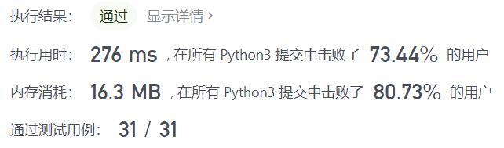
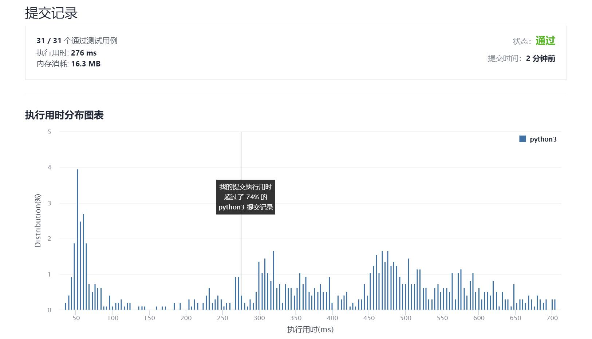

# 524-通过删除字母匹配到字典里最长单词

Author：_Mumu

创建日期：2021/9/14

通过日期：2021/9/14

*****

踩过的坑：

1. 暴力的话，还蛮简单的，我用的方法是双指针
2. 思路是：①对字典中的每个单词，令双指针`i = j = 0`，对该单词的下标为`j`的字母，线性查找它出现在`s`中上一个字母所在下标`i`之后的位置，得到新的`i`，找不到则`break`，否则令`i`和`j`加一；②第一步保证了如果单词是字符串`s`的子序列，则`j`为该单词的长度，于是只需判断该单词是否符合更新最长单词的条件即可
3. 需要注意的是，题目中的“字典序”是指单词在现实字典中由小到大的排序而非在题目所给“字典”中的排序
4. 题解的方法一和我相同，方法二仅是增加一个排序，方法三则是在方法一的基础上，建立表格记录字符串中每个位置之后每个字母第一次出现的位置，于是不需要第一步中的线性查找，$O(1)$地得到所需的索引，这样可以使运行速度大大加快，而建立表格的方法就是动态规划
5. 动态规划牛啊，学习了
6. 此外，看最快的代码，发现大佬并不用动态规划，而是直接用`str.find()`方法来搜索，不懂为啥居然这么快，而且代码里`if...else`的用法也非常神奇

已解决：89/2353

*****

难度：中等

问题描述：

给你一个字符串 s 和一个字符串数组 dictionary 作为字典，找出并返回字典中最长的字符串，该字符串可以通过删除 s 中的某些字符得到。

如果答案不止一个，返回长度最长且字典序最小的字符串。如果答案不存在，则返回空字符串。

 

示例 1：

输入：s = "abpcplea", dictionary = ["ale","apple","monkey","plea"]
输出："apple"
示例 2：

输入：s = "abpcplea", dictionary = ["a","b","c"]
输出："a"

提示：

1 <= s.length <= 1000
1 <= dictionary.length <= 1000
1 <= dictionary[i].length <= 1000
s 和 dictionary[i] 仅由小写英文字母组成

来源：力扣（LeetCode）
链接：https://leetcode-cn.com/problems/longest-word-in-dictionary-through-deleting
