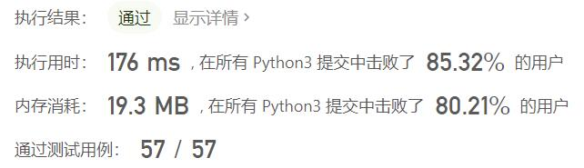
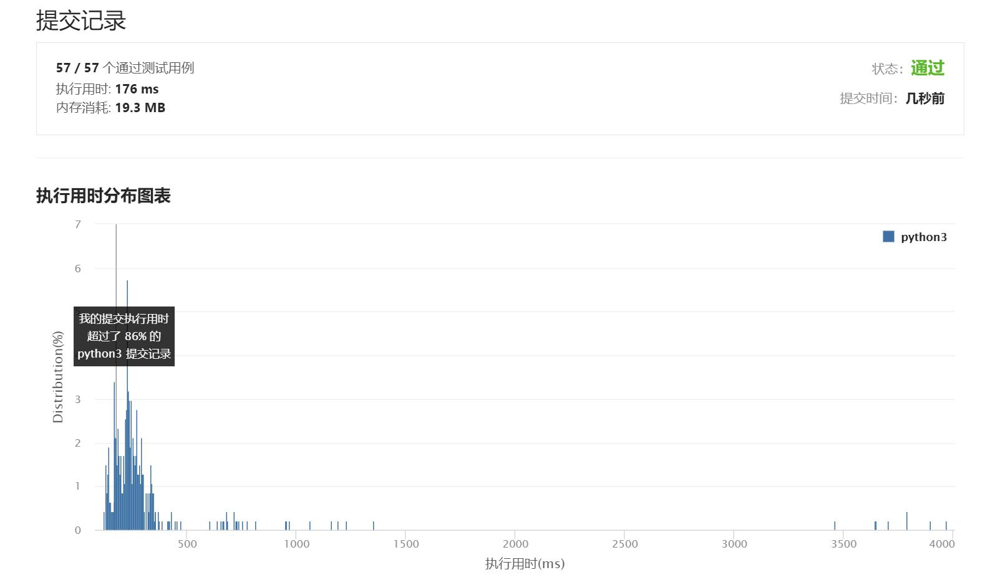

# 528-按权重随机选择

Author：_Mumu

创建日期：2021/8/30

通过日期：2021/8/30

*****

踩过的坑：

1. 太开心了，自己想出来的解法和题解一毛一样
2. 最开始有个想法是，建立新数组，分别按照各索引的权重往数组中添加相同数量的该索引，然后在数组中等概率地提取即可
3. 然后一看数据范围，好家伙这样好像会有点恐怖
4. 然后就去思考别的办法了
5. 然后不知怎么地就想到题解的方法了
6. 我好棒

已解决：71/2332

*****

难度：中等

问题描述：

给定一个正整数数组 w ，其中 w[i] 代表下标 i 的权重（下标从 0 开始），请写一个函数 pickIndex ，它可以随机地获取下标 i，选取下标 i 的概率与 w[i] 成正比。

例如，对于 w = [1, 3]，挑选下标 0 的概率为 1 / (1 + 3) = 0.25 （即，25%），而选取下标 1 的概率为 3 / (1 + 3) = 0.75（即，75%）。

也就是说，选取下标 i 的概率为 w[i] / sum(w) 。

 

示例 1：

输入：
["Solution","pickIndex"]
[[[1]],[]]
输出：
[null,0]
解释：
Solution solution = new Solution([1]);
solution.pickIndex(); // 返回 0，因为数组中只有一个元素，所以唯一的选择是返回下标 0。
示例 2：

输入：
["Solution","pickIndex","pickIndex","pickIndex","pickIndex","pickIndex"]
[[[1,3]],[],[],[],[],[]]
输出：
[null,1,1,1,1,0]
解释：
Solution solution = new Solution([1, 3]);
solution.pickIndex(); // 返回 1，返回下标 1，返回该下标概率为 3/4 。
solution.pickIndex(); // 返回 1
solution.pickIndex(); // 返回 1
solution.pickIndex(); // 返回 1
solution.pickIndex(); // 返回 0，返回下标 0，返回该下标概率为 1/4 。

由于这是一个随机问题，允许多个答案，因此下列输出都可以被认为是正确的:
[null,1,1,1,1,0]
[null,1,1,1,1,1]
[null,1,1,1,0,0]
[null,1,1,1,0,1]
[null,1,0,1,0,0]
......
诸若此类。

提示：

1 <= w.length <= 10000
1 <= w[i] <= 10^5
pickIndex 将被调用不超过 10000 次

来源：力扣（LeetCode）
链接：https://leetcode-cn.com/problems/random-pick-with-weight
