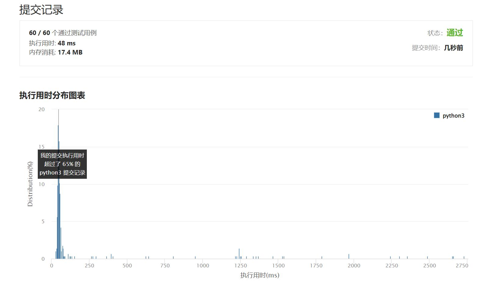

# 532-数组中的k-diff数对

Author：_Mumu

创建日期：2022/06/16

通过日期：2022/06/16

*****

踩过的坑：

1. 轻松愉快

已解决：371/2674

*****

难度：中等

问题描述：

给定一个整数数组和一个整数 k，你需要在数组里找到 不同的 k-diff 数对，并返回不同的 k-diff 数对 的数目。

这里将 k-diff 数对定义为一个整数对 (nums[i], nums[j])，并满足下述全部条件：

0 <= i < j < nums.length
|nums[i] - nums[j]| == k
注意，|val| 表示 val 的绝对值。

 

示例 1：

输入：nums = [3, 1, 4, 1, 5], k = 2
输出：2
解释：数组中有两个 2-diff 数对, (1, 3) 和 (3, 5)。
尽管数组中有两个1，但我们只应返回不同的数对的数量。
示例 2：

输入：nums = [1, 2, 3, 4, 5], k = 1
输出：4
解释：数组中有四个 1-diff 数对, (1, 2), (2, 3), (3, 4) 和 (4, 5)。
示例 3：

输入：nums = [1, 3, 1, 5, 4], k = 0
输出：1
解释：数组中只有一个 0-diff 数对，(1, 1)。

提示：

1 <= nums.length <= 104
-107 <= nums[i] <= 107
0 <= k <= 107

来源：力扣（LeetCode）
链接：https://leetcode.cn/problems/k-diff-pairs-in-an-array